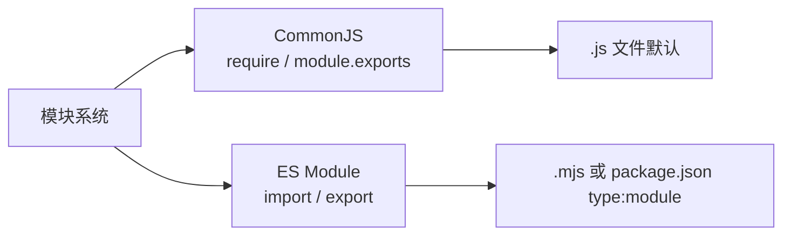
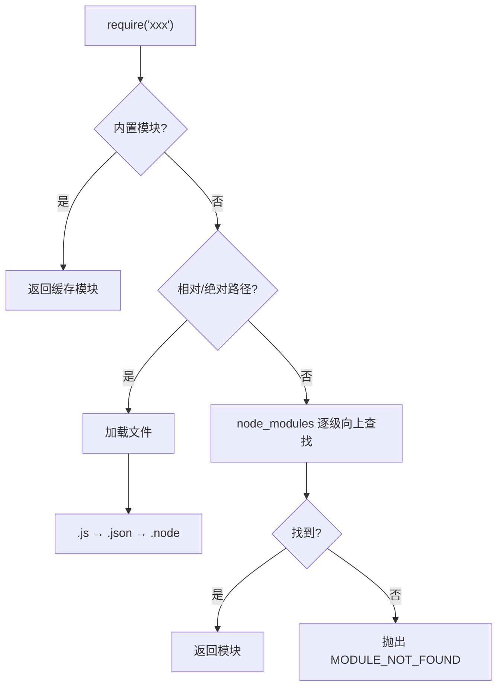
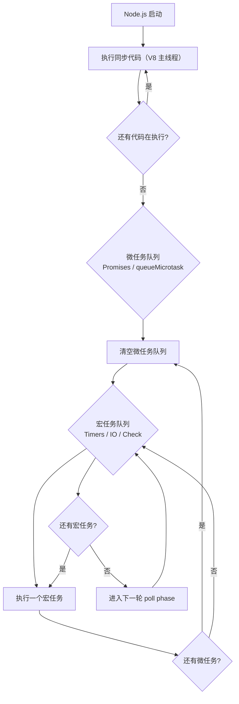
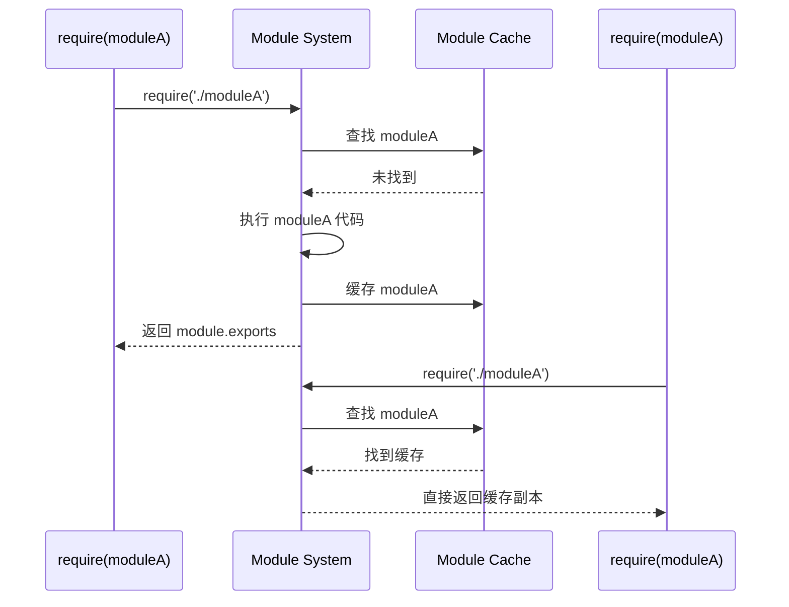

# 第一阶段：Node.js 语言基础

> 本阶段为 NestJS 开发的地基。Node.js 基础不扎实，后续学习会遇到大量概念模糊区。本阶段目标：掌握 Node.js 核心语法、模块系统、异步编程范式，理解 V8 引擎的事件驱动设计思想。

---

## 📐 阶段目标

| 目标 | 说明 |
|------|------|
| 理解 Node.js 运行机制 | V8 引擎、事件循环、线程模型 |
| 掌握模块系统 | CommonJS vs ESM、模块加载顺序 |
| 熟练异步编程 | Callback → Promise → async/await 全链路 |
| 熟练使用内置模块 | fs、path、http、stream、crypto |
| 具备错误处理意识 | 同步/异步错误捕获、unhandledRejection |

---

## 📂 示例代码目录

```
examples/stage1-nodejs/
├── 01-module-system/
│   ├── cjs-export.js          # CommonJS 导出
│   ├── cjs-import.js          # CommonJS 导入
│   ├── esm-export.mjs         # ES Module 导出
│   ├── esm-import.mjs         # ES Module 导入
│   ├── circular-dep.js         # 循环依赖演示
│   └── package-json-fields.js  # package.json 关键字段
├── 02-async-programming/
│   ├── callback-hell.js        # 回调地狱示例
│   ├── promise-chain.js       # Promise 链式调用
│   ├── async-await.js          # async/await 语法
│   ├── parallel-promises.js    # Promise.all 并行
│   └── error-handling.js       # 错误捕获模式
├── 03-builtin-modules/
│   ├── fs-demo.js              # fs 文件操作
│   ├── path-demo.js            # path 路径处理
│   ├── http-demo.js            # http 创建服务
│   ├── stream-demo.js          # stream 流式处理
│   └── crypto-demo.js          # crypto 加密
└── 04-event-loop/
    ├── eventloop-order.js      # 事件循环顺序演示
    └── macro-micro-task.js      # 宏任务与微任务
```

---

## 1️⃣ Node.js 简介与环境搭建

### 1.1 Node.js 是什么

Node.js 是基于 **Chrome V8 引擎** 的 JavaScript 运行时，用于服务端开发。它的核心特征：

```
┌─────────────────────────────────────────────┐
│              Node.js 架构                   │
├─────────────────────────────────────────────┤
│  JavaScript Code (你的代码)                  │
├─────────────────────────────────────────────┤
│  Node.js API (fs/http/path/...)              │
├─────────────────────────────────────────────┤
│  V8 Engine (执行 JS，编译成机器码)            │
├─────────────────────────────────────────────┤
│  libuv (异步 I/O、线程池、事件循环)           │
├─────────────────────────────────────────────┤
│  Operating System (epoll/kqueue/IOCP)        │
└─────────────────────────────────────────────┘
```

### 1.2 安装方式（推荐 nvm）

```bash
# 安装 nvm（Node Version Manager）
curl -o- https://raw.githubusercontent.com/nvm-sh/nvm/v0.40.1/install.sh | bash

# 安装 LTS 版本
nvm install --lts
nvm use --lts

# 验证
node --version     # v22.x.x
npm --version      # 10.x.x
```

### 1.3 npm/yarn/pnpm 对比

| 工具 | 优点 | 缺点 | 适用场景 |
|------|------|------|---------|
| npm | 内置，无需安装 | 速度慢、node_modules 扁平化 | 入门、小项目 |
| yarn | 速度快、离线缓存 | 体积大 | 中型项目 |
| pnpm | 速度快、磁盘占用极低 | 生态兼容性偶有问题 | **NestJS 推荐** |

```bash
# 安装 pnpm
npm install -g pnpm

# NestJS 项目初始化
pnpm init
pnpm add @nestjs/core @nestjs/common
```

---

## 2️⃣ 模块系统

### 2.1 CommonJS vs ES Module

Node.js 支持两套模块系统：



#### CommonJS（Node.js 默认）

```javascript
// examples/stage1-nodejs/01-module-system/cjs-export.js

// 命名导出（多个）
const sum = (a, b) => a + b;
const multiply = (a, b) => a * b;

// 默认导出（只能有一个）
class Calculator {
  calculate(a, b, op) {
    if (op === '+') return sum(a, b);
    if (op === '*') return multiply(a, b);
    throw new Error('Unknown operator');
  }
}

module.exports = {
  sum,
  multiply,
  Calculator,
};
```

```javascript
// examples/stage1-nodejs/01-module-system/cjs-import.js

// 解构导入
const { sum, Calculator } = require('./cjs-export');

console.log(sum(1, 2));              // 3
console.log(new Calculator().calculate(3, 4, '+')); // 7

// 整体导入
const exports = require('./cjs-export');
console.log(exports.multiply(2, 3)); // 6
```

#### ES Module

```javascript
// examples/stage1-nodejs/01-module-system/esm-export.mjs

// 命名导出
export const sum = (a, b) => a + b;
export const multiply = (a, b) => a * b;

// 默认导出
export default class Calculator {
  calculate(a, b, op) {
    if (op === '+') return sum(a, b);
    if (op === '*') return multiply(a, b);
    throw new Error('Unknown operator');
  }
}
```

```javascript

// examples/stage1-nodejs/01-module-system/esm-import.mjs

// 命名导入
import { sum, multiply } from './esm-export.mjs';

// 默认导入
import Calculator from './esm-export.mjs';

// 混合导入
import Calculator, { sum } from './esm-export.mjs';
```

### 2.2 package.json 关键字段

```json
// examples/stage1-nodejs/01-module-system/package-json-fields.json
{
  "name": "my-nodejs-app",
  "version": "1.0.0",
  "type": "module",          // "module" = ESM, "commonjs" 或省略 = CommonJS
  "main": "dist/index.js",   // 入口文件
  "scripts": {
    "dev": "node --watch src/index.js",
    "start": "node dist/index.js",
    "test": "jest"
  },
  "dependencies": {
    "@nestjs/core": "^10.0.0"
  },
  "devDependencies": {
    "typescript": "^5.0.0"
  }
}
```

### 2.3 模块加载顺序

```
┌─────────────────────────────────────────────────────────┐
│               require() 加载顺序                         │
├─────────────────────────────────────────────────────────┤
│ 1. 内置模块（fs/path/http）  →  直接返回缓存              │
│ 2. 相对路径 ./ ../            →  按文件/目录查找          │
│ 3. 绝对路径 /                →  从根目录查找              │
│ 4. 第三方模块 node_modules   →  向上逐级查找              │
└─────────────────────────────────────────────────────────┘
```



---

## 3️⃣ 异步编程

> 这是 Node.js 最核心的部分，也是最容易出错的部分。

### 3.1 异步发展历程

```
Callback (回调地狱)
    ↓
Promise (链式调用 + .catch)
    ↓
async/await (同步语法，写异步代码)
```

### 3.2 Callback 模式（不推荐，但需理解）

```javascript
// examples/stage1-nodejs/02-async-programming/callback-hell.js

// 回调地狱示例：读取文件 → 解析 JSON → 发送请求
const fs = require('fs');

fs.readFile('./user.json', 'utf8', (err, data) => {
  if (err) {
    console.error('读取文件失败:', err);
    return;
  }

  const user = JSON.parse(data);

  fs.readFile(`./orders-${user.id}.json`, 'utf8', (err, orderData) => {
    if (err) {
      console.error('读取订单失败:', err);
      return;
    }

    const orders = JSON.parse(orderData);

    fs.writeFile('./result.json', JSON.stringify(orders), (err) => {
      if (err) {
        console.error('写入失败:', err);
        return;
      }
      console.log('完成!');
      // ... 继续嵌套
    });
  });
});
```

### 3.3 Promise 链式调用

```javascript
// examples/stage1-nodejs/02-async-programming/promise-chain.js

const fs = require('fs').promises; // fs.promises 是 Promise 版本

// 链式调用替代回调地狱
fs.readFile('./user.json', 'utf8')
  .then(data => {
    const user = JSON.parse(data);
    return fs.readFile(`./orders-${user.id}.json`, 'utf8');
  })
  .then(orderData => {
    const orders = JSON.parse(orderData);
    return fs.writeFile('./result.json', JSON.stringify(orders));
  })
  .then(() => {
    console.log('完成!');
  })
  .catch(err => {
    console.error('任何一步出错都会被捕获:', err);
  });
```

### 3.4 async/await（推荐写法）

```javascript
// examples/stage1-nodejs/02-async-programming/async-await.js

const fs = require('fs').promises;

async function processUserData() {
  try {
    // 读取用户文件
    const userData = await fs.readFile('./user.json', 'utf8');
    const user = JSON.parse(userData);

    // 读取订单（串行：等上一个完成再下一个）
    // const orderData = await fs.readFile(`./orders-${user.id}.json`, 'utf8');

    // 并行：两个文件可以同时读取
    const [orderData, configData] = await Promise.all([
      fs.readFile(`./orders-${user.id}.json`, 'utf8'),
      fs.readFile('./config.json', 'utf8'),
    ]);

    const orders = JSON.parse(orderData);
    const config = JSON.parse(configData);

    // 写入结果
    await fs.writeFile('./result.json', JSON.stringify({ user, orders, config }));

    console.log('处理完成!');
  } catch (err) {
    console.error('处理失败:', err);
    throw err; // 重新抛出，供调用方处理
  }
}

processUserData();
```

### 3.5 Promise.all 并行模式

```javascript
// examples/stage1-nodejs/02-async-programming/parallel-promises.js

const fs = require('fs').promises;
const https = require('https');

// 场景：从数据库、文件、外部API同时获取数据，汇总后返回
async function fetchAllData(userId) {
  const start = Date.now();

  // 三个操作互不依赖，并行执行
  const [userData, orderData, configData] = await Promise.all([
    // 模拟数据库查询 (500ms)
    new Promise(resolve => setTimeout(() => resolve({ id: userId, name: '张三' }), 500)),
    // 模拟文件读取 (300ms)
    fs.readFile('./config.json', 'utf8').catch(() => '{}'),
    // 模拟 HTTP 请求 (800ms)
    new Promise((resolve, reject) => {
      https.get('https://api.example.com/config', res => {
        let data = '';
        res.on('data', chunk => data += chunk);
        res.on('end', () => resolve(data));
      }).on('error', reject);
    }),
  ]);

  console.log(`并行耗时: ${Date.now() - start}ms`); // 约 800ms（取最慢的）

  return {
    user: userData,
    orders: JSON.parse(orderData),
    config: configData,
  };
}

// 对比：串行执行
async function fetchAllDataSerial(userId) {
  const start = Date.now();
  const user = await new Promise(r => setTimeout(() => r({ id: userId }), 500));
  const orders = await new Promise(r => setTimeout(() => r([]), 300));
  const config = await new Promise(r => setTimeout(() => r('{}'), 800));
  console.log(`串行耗时: ${Date.now() - start}ms`); // 1600ms（全部累加）
  return { user, orders, config };
}

fetchAllData(1);
```

### 3.6 错误处理模式

```javascript
// examples/stage1-nodejs/02-async-programming/error-handling.js

// ========== 同步错误处理 ==========
try {
  const result = JSON.parse('invalid json');
} catch (err) {
  console.error('JSON 解析错误:', err.message);
}

// ========== 异步错误处理（async/await）==========
async function RiskyOperation() {
  try {
    const data = await fetchDataFromDB();
    return process(data);
  } catch (err) {
    // 记录错误，但不完全吞噬
    console.error('操作失败:', err.message);
    throw new Error('数据处理失败，请稍后重试'); // 重新抛出，带上下文
  }
}

// ========== unhandledRejection 全局捕获 ==========
// 放置在程序入口（如 index.js 最顶部）
process.on('unhandledRejection', (reason, promise) => {
  console.error('未处理的 Promise 拒绝:', reason);
  // 生产环境应上报监控系统
  // Sentry.captureException(reason);
});

// ========== 错误优先回调（Node.js 传统模式）==========
function readFileCallback(err, data) {
  if (err) {
    console.error('失败:', err);
    return;
  }
  console.log('成功:', data);
}

require('fs').readFile('./nonexistent.txt', readFileCallback);
```

---

## 4️⃣ 内置模块详解

### 4.1 fs 模块（文件系统）

```javascript
// examples/stage1-nodejs/03-builtin-modules/fs-demo.js

const fs = require('fs');
const fsPromises = fs.promises;
const path = require('path');

// ========== 同步 vs 异步 vs Promise ==========
// 同步（阻塞，Node.js 主线程，不推荐用于 I/O）
const data = fs.readFileSync('./config.json', 'utf8');

// 异步回调（Node.js 传统风格）
fs.readFile('./config.json', 'utf8', (err, data) => {
  if (err) throw err;
  console.log(data);
});

// Promise 风格（推荐）
(async () => {
  const data = await fsPromises.readFile('./config.json', 'utf8');
  console.log(data);
})();

// ========== 常用操作 ==========
async function demo() {
  // 检查文件/目录是否存在
  const exists = await fsPromises.access('./config.json').then(() => true).catch(() => false);

  // 读取目录
  const files = await fsPromises.readdir('./src');

  // 创建目录（递归）
  await fsPromises.mkdir('./dist/logs', { recursive: true });

  // 复制文件
  await fsPromises.copyFile('./src/index.js', './dist/index.js');

  // 获取文件信息
  const stats = await fsPromises.stat('./config.json');
  console.log('文件大小:', stats.size, '字节');
  console.log('创建时间:', stats.birthtime);
  console.log('是否文件:', stats.isFile());
  console.log('是否目录:', stats.isDirectory());
}
```

### 4.2 path 模块（路径处理）

```javascript
// examples/stage1-nodejs/03-builtin-modules/path-demo.js

const path = require('path');

// 不同操作系统路径分隔符不同
console.log('分隔符:', path.sep);              // Linux: /   Windows: \

// 拼接路径（自动处理分隔符）
const fullPath = path.join('src', 'controllers', 'user.js');
console.log(fullPath);                        // src/controllers/user.js

// 解析为绝对路径
const absPath = path.resolve('src', 'index.js');
console.log(absPath);                         // /root/workspace/.../src/index.js

// 获取路径组成部分
console.log(path.dirname('/src/index.js'));  // /src
console.log(path.basename('/src/index.js')); // index.js
console.log(path.extname('/src/index.js'));  // .js

// path.parse vs path.format
const parsed = path.parse('/src/index.js');
console.log(parsed);
// { root: '/', dir: '/src', base: 'index.js', ext: '.js', name: 'index' }

const formatted = path.format(parsed);
console.log(formatted);                       // /src/index.js

// Windows vs POSIX（跨平台注意）
// path.join 始终使用系统分隔符
// path.posix.join 强制使用 /
```

### 4.3 http 模块（创建 HTTP 服务）

```javascript
// examples/stage1-nodejs/03-builtin-modules/http-demo.js

const http = require('http');
const url = require('url');

// 创建 HTTP 服务器
const server = http.createServer((req, res) => {
  // 解析请求 URL
  const parsedUrl = url.parse(req.url, true);
  const pathname = parsedUrl.pathname;
  const query = parsedUrl.query;

  // 设置 CORS 头
  res.setHeader('Access-Control-Allow-Origin', '*');
  res.setHeader('Content-Type', 'application/json; charset=utf-8');

  // 路由
  if (pathname === '/api/health' && req.method === 'GET') {
    res.statusCode = 200;
    res.end(JSON.stringify({ status: 'ok', timestamp: Date.now() }));
  } else if (pathname === '/api/user' && req.method === 'GET') {
    res.statusCode = 200;
    res.end(JSON.stringify({ id: query.id || 1, name: '张三' }));
  } else {
    res.statusCode = 404;
    res.end(JSON.stringify({ error: 'Not Found' }));
  }
});

server.listen(3000, () => {
  console.log('HTTP 服务已启动: http://localhost:3000');
});

// ========== http.Client 请求外部接口 ==========
function fetchExternalApi() {
  return new Promise((resolve, reject) => {
    const options = {
      hostname: 'api.example.com',
      port: 443,
      path: '/users/1',
      method: 'GET',
      headers: {
        'Accept': 'application/json',
      },
    };

    const req = https.request(options, (res) => {
      let data = '';
      res.on('data', chunk => data += chunk);
      res.on('end', () => {
        try {
          resolve(JSON.parse(data));
        } catch (e) {
          reject(new Error('JSON 解析失败'));
        }
      });
    });

    req.on('error', reject);
    req.end();
  });
}
```

### 4.4 stream 模块（流式处理）

```javascript
// examples/stage1-nodejs/03-builtin-modules/stream-demo.js

const fs = require('fs');
const { Transform } = require('stream');

// ========== 流的三种类型 ==========
// Readable  - 可读流（数据源）
// Writable  - 可写流（数据目的地）
// Transform - 转换流（边读边转换）

// ========== 文件复制（大文件友好，不占满内存）==========
async function copyFileBig(src, dest) {
  return new Promise((resolve, reject) => {
    const readStream = fs.createReadStream(src);
    const writeStream = fs.createWriteStream(dest);

    // pipe 自动管理背压（backpressure）
    readStream.pipe(writeStream)
      .on('finish', resolve)
      .on('error', reject);

    readStream.on('error', reject);
  });
}

// ========== Transform 流：边读边转换（如 gzip）==========
// 场景：日志文件，每行加上行号
function createLineNumberTransform() {
  let lineNumber = 0;
  return new Transform({
    transform(chunk, encoding, callback) {
      const lines = chunk.toString().split('\n');
      const result = lines.map(line => `${++lineNumber}: ${line}`).join('\n');
      // 注意：最后一行可能不完整
      callback(null, result + '\n');
    },
  });
}

// 使用示例：
// fs.createReadStream('./input.log')
//   .pipe(createLineNumberTransform())
//   .pipe(fs.createWriteStream('./output.log'));

// ========== 流式处理大文件的优势 ==========
// 普通方式：fs.readFile → 全部读入内存（内存爆炸）
// 流方式：createReadStream → 逐 chunk 读取（固定内存占用）
function demonstrateStreamAdvantage() {
  // 大文件（如 10GB 日志文件）
  const BIG_FILE = './huge-file.log';

  console.time('readFile（全部读入内存）');
  // const data = await fs.promises.readFile(BIG_FILE); // 危险：10GB 内存！
  console.timeEnd('readFile（全部读入内存）');

  console.time('流式读取（固定内存）');
  // const stream = fs.createReadStream(BIG_FILE, { highWaterMark: 64 * 1024 });
  // 每次只读取 64KB，无论文件多大
  console.timeEnd('流式读取（固定内存）');
}
```

### 4.5 crypto 模块（加密）

```javascript
// examples/stage1-nodejs/03-builtin-modules/crypto-demo.js

const crypto = require('crypto');

// ========== 散列算法（Hash）==========
function hashDemo(data) {
  const hash = crypto.createHash('sha256');
  hash.update(data);
  return hash.digest('hex'); // 十六进制字符串
}

// ========== HMAC（带密钥的散列）==========
function hmacDemo(data, key) {
  return crypto.createHmac('sha256', key).update(data).digest('hex');
}

// ========== AES 对称加密 ==========
function aesEncrypt(text, password) {
  const key = crypto.scryptSync(password, 'salt', 32); // 32 字节密钥
  const iv = crypto.randomBytes(16);                    // 初始化向量
  const cipher = crypto.createCipheriv('aes-256-cbc', key, iv);

  let encrypted = cipher.update(text, 'utf8', 'hex');
  encrypted += cipher.final('hex');

  return {
    iv: iv.toString('hex'),
    encrypted,
  };
}

function aesDecrypt(encryptedData, password) {
  const key = crypto.scryptSync(password, 'salt', 32);
  const decipher = crypto.createDecipheriv(
    'aes-256-cbc',
    key,
    Buffer.from(encryptedData.iv, 'hex')
  );

  let decrypted = decipher.update(encryptedData.encrypted, 'hex', 'utf8');
  decrypted += decipher.final('utf8');

  return decrypted;
}

// ========== RSA 非对称加密 ==========
const { publicKey, privateKey } = crypto.generateKeyPairSync('rsa', {
  modulusLength: 2048,
});

function rsaEncrypt(data) {
  return crypto.publicEncrypt(
    { key: publicKey, padding: crypto.constants.RSA_PKCS1_OAEP_PADDING },
    Buffer.from(data)
  ).toString('base64');
}

function rsaDecrypt(encrypted) {
  return crypto.privateDecrypt(
    { key: privateKey, padding: crypto.constants.RSA_PKCS1_OAEP_PADDING },
    Buffer.from(encrypted, 'base64')
  ).toString('utf8');
}

// ========== UUID ==========
function uuidDemo() {
  return crypto.randomUUID(); // Node.js 14.17+ 内置
}
```

---

## 5️⃣ 事件循环（Event Loop）

> 这是理解 Node.js 非阻塞特性的核心。面试必问。

### 5.1 事件循环执行顺序



### 5.2 宏任务 vs 微任务

```javascript
// examples/stage1-nodejs/04-event-loop/macro-micro-task.js

console.log('1️⃣ 同步代码 start');

setTimeout(() => console.log('4️⃣ setTimeout (宏任务)'), 0);

Promise.resolve()
  .then(() => console.log('3️⃣ Promise.then (微任务)'))
  .then(() => console.log('5️⃣ Promise.then 链 (微任务)'));

queueMicrotask(() => console.log('3️⃣ queueMicrotask (微任务)'));

process.nextTick(() => console.log('2️⃣ process.nextTick (特殊微任务，优先级最高)'));

console.log('1️⃣ 同步代码 end');

// 输出顺序：
// 1️⃣ 同步代码 start
// 1️⃣ 同步代码 end
// 2️⃣ process.nextTick
// 3️⃣ queueMicrotask
// 3️⃣ Promise.then (第一个 .then)
// 5️⃣ Promise.then 链 (第二个 .then)
// 4️⃣ setTimeout
```

### 5.3 事件循环顺序完整演示

```javascript
// examples/stage1-nodejs/04-event-loop/eventloop-order.js

console.log('【同步1】script start');

setTimeout(() => {
  console.log('【宏任务】setTimeout 1');
  Promise.resolve().then(() => console.log('【微任务】setTimeout 内部 Promise'));
}, 0);

setTimeout(() => {
  console.log('【宏任务】setTimeout 2');
}, 0);

Promise.resolve().then(() => console.log('【微任务】Promise 1'));
Promise.resolve().then(() => console.log('【微任务】Promise 2'));
Promise.resolve().then(() => {
  console.log('【微任务】Promise 3');
  process.nextTick(() => console.log('【特殊微任务】nextTick 在 Promise 内部'));
});

process.nextTick(() => console.log('【特殊微任务】nextTick 1'));
process.nextTick(() => console.log('【特殊微任务】nextTick 2'));

console.log('【同步2】script end');

/*
执行顺序：
【同步1】script start
【同步2】script end
【特殊微任务】nextTick 1
【特殊微任务】nextTick 2
【微任务】Promise 1
【微任务】Promise 2
【微任务】Promise 3
【特殊微任务】nextTick 在 Promise 内部
【宏任务】setTimeout 1
【微任务】setTimeout 内部 Promise
【宏任务】setTimeout 2
*/
```

### 5.4 理解 Node.js 线程模型

```
┌──────────────────────────────────────────────────────────┐
│                    Node.js 进程                          │
├──────────────────────────────────────────────────────────┤
│                                                          │
│  ┌────────────────┐    ┌────────────────────────────┐   │
│  │   V8 主线程     │    │       libuv 线程池         │   │
│  │  （单线程）     │    │    （默认 4 个线程）        │   │
│  │                │    │                            │   │
│  │  同步代码执行   │    │  异步 I/O 操作             │   │
│  │  Promise 执行   │    │  文件系统 fs.*             │   │
│  │  事件循环       │    │  DNS.lookup()             │   │
│  │                │    │  crypto 加密计算           │   │
│  └────────┬───────┘    └─────────────┬──────────────┘   │
│           │                          │                   │
│           └──────────┐ ┌─────────────┘                   │
│                      ↓                                   │
│              ┌──────────────┐                            │
│              │   事件队列    │                            │
│              │ (Event Queue)│                            │
│              └──────────────┘                            │
│                                                          │
└──────────────────────────────────────────────────────────┘

注意：
- JavaScript 代码始终在 V8 主线程执行（单线程，不存在锁问题）
- I/O 操作（文件读写、网络请求）由 libuv 线程池处理
- libuv 线程池大小可通过 UV_THREADPOOL_SIZE 调整（最大 1024）
- CPU 密集型任务（加密压缩）会占用线程池，应考虑 Worker Threads
```

---

## 6️⃣ Node.js 核心设计思想

### 6.1 非阻塞 I/O + 事件驱动

```
传统多线程模型（Java）：
  请求1 → [线程1：阻塞等待 I/O]
  请求2 → [线程2：阻塞等待 I/O]
  请求3 → [线程3：阻塞等待 I/O]
  问题：线程创建/切换开销大，内存占用高

Node.js 模型：
  请求1 → [主线程：注册回调] → I/O 线程池处理
  请求2 → [主线程：注册回调] → I/O 线程池处理
  请求3 → [主线程：注册回调] → I/O 线程池处理
  优势：单线程处理海量并发，线程复用
```

### 6.2 模块缓存机制



### 6.3 Node.js 适合做什么

| ✅ 适合 | ❌ 不适合 |
|--------|---------|
| RESTful API / 微服务 | CPU 密集型计算（如视频转码）|
| 实时应用（WebSocket）| 复杂图像处理（用 Worker Threads）|
| I/O 密集型操作 | 大文件复杂处理 |
| CLI 工具 | 大数据科学计算 |
| 前后端同构 | 大型游戏服务端（建议 Go/C++）|

---

## 📝 本阶段练习题

1. **模块题**：实现一个 `format-date.js`，导出 `formatDate(date, format)` 函数，同时导出 `FORMAT_PATTERNS` 常量对象
2. **异步题**：将以下回调代码改写为 async/await：
   ```javascript
   fs.readdir('./logs', (err, files) => {
     files.forEach(file => {
       fs.unlink(`./logs/${file}`, err => {});
     });
   });
   ```
3. **流题**：使用 stream 实现一个大文件的行数统计（不读入全部内存）
4. **事件循环题**：写出以下代码的输出顺序：
   ```javascript
   setTimeout(() => console.log('A'), 0);
   Promise.resolve().then(() => console.log('B'));
   process.nextTick(() => console.log('C'));
   console.log('D');
   ```

---

## 🔗 相关资源

- [Node.js 官方文档](https://nodejs.org/docs/latest/)
- [Node.js 事件循环可视化](http://latentflip.com/loupe)
- [字节跳动：深入理解 Node.js 事件循环](https://zhuanlan.zhihu.com/p/137161875)

---

**下一阶段预告**：[第二阶段：NestJS 核心概念与 HTTP 开发](./第二阶段_NestJS核心概念.md)

> 掌握 Module、Controller、Provider 三大核心，理解依赖注入（AOP 思想），独立开发 RESTful API。
