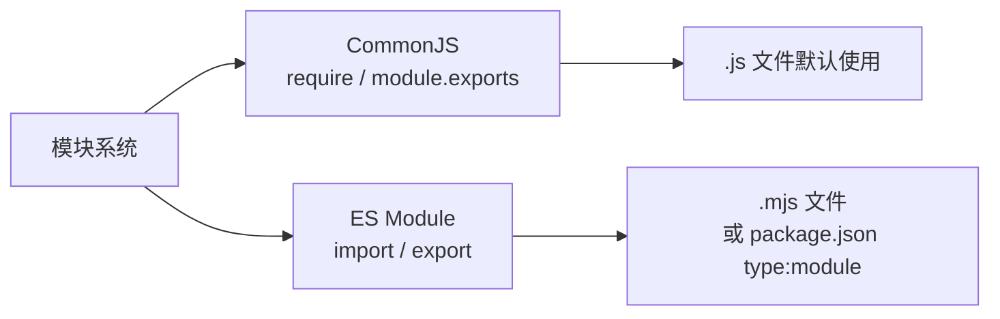

# 第一阶段：Node.js 语言基础

> 本阶段为 NestJS 开发的地基。Node.js 基础不扎实，后续学习会遇到大量概念模糊区。本阶段目标：掌握 Node.js 核心语法、模块系统、异步编程范式，理解 V8 引擎的事件驱动设计思想。

---

## 📐 阶段目标

| 目标 | 说明 |
|------|------|
| 理解 Node.js 运行机制 | V8 引擎、事件循环、线程模型 |
| 掌握模块系统 | CommonJS vs ESM、模块加载顺序 |
| 熟练异步编程 | Callback → Promise → async/await 全链路 |
| 熟练使用内置模块 | fs、path、http、stream、crypto |
| 具备错误处理意识 | 同步/异步错误捕获、unhandledRejection |

---

## 📂 示例代码目录

```
examples/stage1-nodejs/
├── 01-module-system/
│   ├── cjs-export.js          # CommonJS 导出
│   ├── cjs-import.js          # CommonJS 导入
│   ├── esm-export.mjs         # ES Module 导出
│   ├── esm-import.mjs         # ES Module 导入
│   ├── circular-dep.js         # 循环依赖演示
│   └── package-json-fields.js  # package.json 关键字段
├── 02-async-programming/
│   ├── callback-hell.js        # 回调地狱示例
│   ├── promise-chain.js       # Promise 链式调用
│   ├── async-await.js          # async/await 语法
│   ├── parallel-promises.js    # Promise.all 并行
│   └── error-handling.js       # 错误捕获模式
├── 03-builtin-modules/
│   ├── fs-demo.js              # fs 文件操作
│   ├── path-demo.js            # path 路径处理
│   ├── http-demo.js            # http 创建服务
│   ├── stream-demo.js          # stream 流式处理
│   └── crypto-demo.js          # crypto 加密
└── 04-event-loop/
    ├── eventloop-order.js      # 事件循环顺序演示
    └── macro-micro-task.js      # 宏任务与微任务
```

---

## 1️⃣ Node.js 简介与环境搭建

### 1.1 Node.js 是什么

#### 🔍 先理解问题：JavaScript 原来只能在浏览器里跑

在 2009 年之前，JavaScript 只能运行在浏览器里（比如 Chrome 浏览器的 JS 引擎叫 V8）。你写的 JS 代码只能操作网页 DOM，不能读取文件、不能连接数据库、不能做服务器——只能"做网页上的交互效果"。

**Node.js 的诞生**：Ryan Dahl 把 Chrome 的 V8 引擎搬到了服务器端，让 JavaScript 第一次可以"系统级"操作——读写文件、连接网络、调用操作系统底层能力。从此，前端工程师也能写后端代码了。

#### 什么是 V8 引擎？

> **V8 是 Chrome 浏览器的 JavaScript 引擎**，它的任务是：把你写的 JavaScript 代码编译成机器码（CPU 能直接执行的指令），让代码跑得飞快。

打个比方：
- 你写的 JS 代码 = 中文菜谱
- V8 = 厨房里的翻译机器人，把菜谱翻译成厨师能听懂的具体动作
- 厨师 = 你的电脑 CPU

V8 的特别之处在于**编译速度极快**（ JIT 编译：边运行边优化），所以 Chrome 和 Node.js 执行 JS 效率都很高。

#### Node.js 架构五层（为什么要了解）

```
┌─────────────────────────────────────────────┐
│              Node.js 架构                   │
├─────────────────────────────────────────────┤
│  JavaScript Code (你的代码)                  │
│  ← 你写的所有逻辑都在这一层                  │
├─────────────────────────────────────────────┤
│  Node.js API (fs/http/path/...)            │
│  ← Node.js 提供给 JS 的"工具箱"接口         │
├─────────────────────────────────────────────┤
│  V8 Engine (执行 JS，编译成机器码)           │
│  ← 编译 JS → 机器码，真正执行代码的地方      │
├─────────────────────────────────────────────┤
│  libuv (异步 I/O、线程池、事件循环)          │
│  ← 核心！处理所有"慢操作"的幕后英雄          │
├─────────────────────────────────────────────┤
│  Operating System (epoll/kqueue/IOCP)       │
│  ← 操作系统提供的底层能力（网络/文件等）     │
└─────────────────────────────────────────────┘
```

**理解要点**：
- **V8**：负责执行 JS 单线程代码（跑得快）
- **libuv**：负责处理异步 I/O 操作（不怕慢）
- **两者配合**：V8 遇到"慢操作"（如读文件）就通知 libuv，libuv 在后台处理完后再通知 V8 继续执行

#### 🧠 理解检查
- Q: Node.js 为什么能同时处理成千上万个网络请求，却不需要为每个请求创建一个线程？
- A: 因为 Node.js 的"慢操作"（网络 I/O、文件读取）都交给 libuv 的线程池处理了，V8 主线程始终空闲着等待回调，不被阻塞。

### 1.2 安装方式（推荐 nvm）

#### 什么是 nvm？为什么不直接装 Node？

> **nvm = Node Version Manager**，Node.js 版本管理工具。

问题场景：你电脑上有个老项目需要 Node.js 14，新项目需要 Node.js 22，直接装会冲突。nvm 让你可以在同一台电脑上安装多个 Node 版本，随时切换。

类比：Python 的 pyenv、Ruby 的 rvm、Java 的 jenv 都是同样的思路。

```bash
# 安装 nvm（Node Version Manager）
curl -o- https://raw.githubusercontent.com/nvm-sh/nvm/v0.40.1/install.sh | bash

# 安装 LTS 版本（长期支持版，最稳定）
nvm install --lts

# 使用 LTS 版本
nvm use --lts

# 验证安装成功
node --version     # v22.x.x  → Node.js 主版本号
npm --version     # 10.x.x   → Node 自带的包管理器版本
```

**LTS vs 最新版**：生产环境用 LTS（稳定），学习用最新版（功能多）。

### 1.3 npm/yarn/pnpm 对比

#### 这三个都是"包管理器"，区别在哪？

> **包管理器 = 替你从网上下载别人写好的代码库的工具**。就像手机的应用商店，帮你安装/更新/卸载各种"工具"。

| 工具 | 优点 | 缺点 | 适用场景 |
|------|------|------|---------|
| npm | 内置，无需安装，生态最大 | 速度慢、安装的包容易重复 | 入门、小项目 |
| yarn | 速度快、离线缓存、进度条清晰 | 体积大、lockfile 格式冗余 | 中型项目 |
| pnpm | **速度快 + 磁盘占用极低 + 更安全** | 偶有兼容性问题 | **NestJS 推荐** |

**为什么 NestJS 推荐 pnpm？**
- NestJS 依赖很多（几十个包），pnpm 安装速度快 2-3 倍
- pnpm 用"硬链接"共享相同版本包，磁盘空间节省 50-70%
- pnpm 的依赖隔离更好，避免"幽灵依赖"问题

```bash
# 安装 pnpm（全局安装一次）
npm install -g pnpm

# 用 pnpm 初始化项目
pnpm init

# 用 pnpm 安装包（加 -D 是开发依赖，-S 是生产依赖）
pnpm add @nestjs/core @nestjs/common       # 安装 NestJS 核心包
pnpm add -D typescript @types/node         # 安装类型定义（TS开发必需）
```

---

## 2️⃣ 模块系统

### 2.1 CommonJS vs ES Module

#### 先问：什么是"模块"？为什么要模块化？

> **模块 = 把代码拆分成独立文件的思想**。

想象你写一本书，如果没有"章节"和"目录"，把所有内容堆在一个文档里，会是什么样子？代码也一样：
- 不模块化：所有函数写在一个文件里，几千行，根本没法维护
- 模块化：每个功能一个文件，通过"导入/导出"互相引用，清晰易懂

**Node.js 支持两套模块系统**（这是历史遗留问题，记住就行）：



#### CommonJS（Node.js 默认）

> **CommonJS = Node.js 诞生时就自带的模块系统**，用 `require()` 导入，`module.exports` 导出。简单直接，Node.js 内置支持。

**核心语法**：
- `require('路径')` = 导入
- `module.exports = xxx` = 导出（整个文件只能有一个）

```javascript
// examples/stage1-nodejs/01-module-system/cjs-export.js

// === 导出（给别人用） ===

// 命名导出（可以导出一个或多个）
const sum = (a, b) => a + b;
const multiply = (a, b) => a * b;

// 默认导出（整个文件只能有一个）
// 默认导出的东西，在导入时叫什么名字都行
class Calculator {
  calculate(a, b, op) {
    if (op === '+') return sum(a, b);
    if (op === '*') return multiply(a, b);
    throw new Error('Unknown operator');
  }
}

module.exports = {
  sum,       // 命名导出
  multiply,  // 命名导出
  Calculator, // 默认导出（用 class 表示）
};
```

**导出的意思**：告诉 Node.js "这个文件可以被别人用，这些是我愿意分享出去的功能"。

```javascript
// examples/stage1-nodejs/01-module-system/cjs-import.js

// === 导入（用别人的模块） ===

// 解构导入（对应命名导出）
const { sum, Calculator } = require('./cjs-export');

console.log(sum(1, 2));                               // 3
console.log(new Calculator().calculate(3, 4, '+'));   // 7

// 整体导入（把导出的对象整个拿过来）
const myModule = require('./cjs-export');
console.log(myModule.multiply(2, 3));                  // 6
```

**导入的本质**：`require('./cjs-export')` 告诉 Node.js "去把那个文件执行一遍，然后返回它的导出对象"。

#### ES Module（新版标准）

> **ES Module = ES6 官方推出的模块系统**，用 `import` 导入，`export` 导出。更现代，但 Node.js 支持需要配置。

**为什么需要两套？** ES Module 是 JavaScript 语言标准（所有浏览器和 Node.js 都会支持），而 CommonJS 是 Node.js 私有的。长远来看 ES Module 才是未来。

**核心语法**：
- `import xxx from '模块'` = 导入
- `export const xxx = ...` = 命名导出
- `export default xxx` = 默认导出

```javascript
// examples/stage1-nodejs/01-module-system/esm-export.mjs
// 注意：ES Module 文件后缀是 .mjs

// 命名导出（可以多个）
export const sum = (a, b) => a + b;
export const multiply = (a, b) => a * b;

// 默认导出（只能有一个）
export default class Calculator {
  calculate(a, b, op) {
    if (op === '+') return sum(a, b);
    if (op === '*') return multiply(a, b);
    throw new Error('Unknown operator');
  }
}
```

```javascript
// examples/stage1-nodejs/01-module-system/esm-import.mjs

// 命名导入（对应命名导出）
import { sum, multiply } from './esm-export.mjs';

// 默认导入（对应默认导出）
import Calculator from './esm-export.mjs';

// 混合导入（同时用默认和命名）
import Calculator, { sum } from './esm-export.mjs';
```

#### CommonJS vs ESM 核心区别

| 对比项 | CommonJS (CJS) | ES Module (ESM) |
|--------|---------------|-----------------|
| 导入语法 | `require()` | `import` |
| 导出语法 | `module.exports` | `export` |
| 加载方式 | **同步**（运行时加载）| **异步**（编译时确定）|
| 导入的是 | 值的**拷贝** | 值的**引用**（只读）|
| 文件后缀 | `.js`（默认）| `.mjs` 或 `package.json type:module` |

**最关键的区别**：
- CommonJS 在运行时确定依赖，想 `require()` 放在 if 条件里都可以
- ES Module 在编译时就确定依赖，所有 `import` 必须写在顶层（不能嵌套在 if 里）

#### 🧠 理解检查
- Q: 为什么 ES Module 不能写在 if 条件里，但 CommonJS 可以？
- A: ES Module 需要在编译阶段就确定"导入了什么"，而 CommonJS 是运行时执行的，所以可以动态决定。

### 2.2 package.json 关键字段

> **package.json = Node.js 项目的"身份证和清单"**，记录项目名称、版本、依赖了哪些包、如何运行测试等。

```json
// examples/stage1-nodejs/01-module-system/package-json-fields.json
{
  "name": "my-nodejs-app",       // 项目名称（发布到 npm 时唯一标识）
  "version": "1.0.0",           // 版本号（语义化版本：主.次.补丁）
  "type": "module",              // ← 关键！不写或"commonjs"用CJS，"module"用ESM
  "main": "dist/index.js",       // 别人require你的包时，默认加载这个文件
  "scripts": {                   // 快捷命令别名
    "dev": "node --watch src/index.js",  // pnpm dev 运行这个
    "start": "node dist/index.js",        // pnpm start
    "test": "jest"                        // pnpm test
  },
  "dependencies": {               // 生产环境依赖（项目上线运行必需）
    "@nestjs/core": "^10.0.0"    // ^表示"兼容 10.x.x"
  },
  "devDependencies": {            // 开发环境依赖（写代码时用到，上线不需要）
    "typescript": "^5.0.0"       // TS 编译器
  }
}
```

**scripts 小技巧**：
```bash
pnpm dev        # 开发模式（热重载）
pnpm build      # 构建（TS编译成JS）
pnpm start      # 生产模式
pnpm test       # 运行测试
```

### 2.3 模块加载顺序

> **require() 加载顺序** = Node.js 找文件时"按优先级逐层检查"的过程。

```
┌─────────────────────────────────────────────────────────┐
│               require() 加载顺序（优先级从高到低）       │
├─────────────────────────────────────────────────────────┤
│ 1️⃣ 内置模块（fs/path/http）→ 直接返回，缓存一份          │
│     写 require('fs')，Node 认识它是内置模块，直接给       │
│                                                          │
│ 2️⃣ 相对路径 ./ ../ → 从当前文件位置开始查找              │
│     require('./utils') → 先找 ./utils.js                 │
│     require('./utils') → 再找 ./utils/index.js          │
│                                                          │
│ 3️⃣ 绝对路径 / → 从操作系统根目录开始查找                 │
│     require('/Users/admin/utils')                        │
│                                                          │
│ 4️⃣ 第三方模块 node_modules → 向上逐级搜索                │
│     require('lodash') → 先看当前目录/node_modules       │
│     → 再看上级/node_modules → 一直找到根目录            │
│     → 找不到就报错 MODULE_NOT_FOUND                      │
└─────────────────────────────────────────────────────────┘
```

**第三方的 node_modules 查找过程**：
```
当前文件：/root/src/app.js
require('lodash')

查找路径：
  /root/src/node_modules/lodash     ✗ 不存在
  /root/node_modules/lodash          ✓ 找到了！
```

这就是为什么 npm install 会把包装在项目根目录的 node_modules 里——这样从项目任何位置都能找到。

---

## 3️⃣ 异步编程

> **这是 Node.js 最核心的部分，也是最容易出错的部分。** 理解异步，是掌握 Node.js 的关键。

### 3.1 先理解同步 vs 异步

#### 🍜 同步 vs 异步的餐厅类比

**同步排队打饭**：
1. 你到窗口，跟阿姨说"要一份宫保鸡丁"
2. 阿姨去炒，你站着等（阻塞）
3. 炒好了，端给你
4. 去下一个窗口...

你每个窗口都要等上一个人完全处理完才能轮到。

**异步点餐**：
1. 你到窗口，跟服务员说"要一份宫保鸡丁，我先去坐着了，做好了叫我"
2. 服务员收下你的单子，去炒菜
3. 你在座位上刷手机（可以做其他事）
4. 菜好了，服务员叫"33号！"你过来拿

**Node.js 的异步** = 异步点餐模式。你发出一个"慢操作"（读文件、网络请求），Node.js 去处理，你继续做其他事，等好了再回调通知你。

#### 异步发展历程（理解历史脉络）

```
.Callback (回调地狱)
    ↓ 为什么：最早只有回调，没有其他方案
.Promise (链式调用 + .catch)
    ↓ 为什么：回调嵌套太深，难以维护
async/await (同步语法，写异步代码) ← 当前主流
    ↓ 为什么：代码看起来像同步，更易读易写
```

### 3.2 Callback 模式（不推荐，但需理解）

> **回调函数 = 把一个函数作为参数传给另一个函数，等那个函数执行完再调用"通知你"**。

Callback 是 Node.js 最早期的异步写法，特点是**错误优先**：回调函数的第一个参数永远是错误对象。

```javascript
// examples/stage1-nodejs/02-async-programming/callback-hell.js

// 这是"回调地狱"——多层嵌套的回调函数
// 场景：读取用户文件 → 根据用户ID读取订单 → 写入结果
const fs = require('fs');

fs.readFile('./user.json', 'utf8', (err, data) => {
  // ↑ fs.readFile 第三个参数是一个函数（回调）
  //   读取完成后，Node.js 调用这个函数，传入 (错误, 数据)

  if (err) {
    console.error('读取文件失败:', err);  // 错误处理
    return;                               // 出错了就停
  }

  // data 是文件内容（字符串）
  const user = JSON.parse(data);

  // 第一层嵌套：读取订单
  fs.readFile(`./orders-${user.id}.json`, 'utf8', (err, orderData) => {
    if (err) {
      console.error('读取订单失败:', err);
      return;
    }

    const orders = JSON.parse(orderData);

    // 第二层嵌套：写入结果
    fs.writeFile('./result.json', JSON.stringify(orders), (err) => {
      if (err) {
        console.error('写入失败:', err);
        return;
      }
      console.log('完成!');
      // ... 再嵌套一层会怎样？三层四层？
    });
  });
});
```

**回调地狱的问题**：嵌套太深，错误处理重复，代码逻辑是"横着走"的，阅读和维护都很痛苦。

### 3.3 Promise 链式调用

> **Promise = 承诺"。当你调用一个返回 Promise 的函数时，它"承诺"你：要么成功给你结果，要么失败告诉你原因。**

Promise 解决了回调地狱的问题——用链式调用（`.then().then().catch()`）代替嵌套。

```javascript
// examples/stage1-nodejs/02-async-programming/promise-chain.js

const fs = require('fs').promises; // fs.promises 是 Promise 版本的 fs

// 链式调用：then() 处理成功，catch() 处理任何一步的错误
fs.readFile('./user.json', 'utf8')
  .then(data => {
    // 第一个 .then 收到的是 readFile 的结果（文件内容字符串）
    const user = JSON.parse(data);
    // 返回一个新的 Promise，让下一个 .then 继续
    return fs.readFile(`./orders-${user.id}.json`, 'utf8');
  })
  .then(orderData => {
    // 第二个 .then 收到的是上一步返回的 Promise 的结果
    const orders = JSON.parse(orderData);
    return fs.writeFile('./result.json', JSON.stringify(orders));
  })
  .then(() => {
    // 写文件成功后执行
    console.log('完成!');
  })
  .catch(err => {
    // ★ 关键！任何一步出错都会被这个 catch 捕获
    console.error('任何一步出错都会被捕获:', err);
  });
```

**Promise 的三种状态**：
```
pending（等待中）→ 初始状态，操作还没完成
    ↓
fulfilled（已成功）→ 操作成功完成，调用 .then()
    ↓
rejected（已失败）→ 操作失败，调用 .catch()
```

### 3.4 async/await（推荐写法）

> **async/await = Promise 的"语法糖"，让你用同步的写法写异步代码**。

**核心规则**：
- `async` 函数**永远返回 Promise**
- `await` 等待一个 Promise 完成（只能在 async 函数里用）
- `await` 等待期间，**不阻塞主线程**（Node.js 继续处理其他事）

```javascript
// examples/stage1-nodejs/02-async-programming/async-await.js

const fs = require('fs').promises;

async function processUserData() {
  try {
    // 读取用户文件（await = 等这个 Promise 完成再继续）
    const userData = await fs.readFile('./user.json', 'utf8');
    const user = JSON.parse(userData);

    // 串行（等上一个完成再下一个）：
    // const orderData = await fs.readFile(`./orders-${user.id}.json`, 'utf8');

    // ★ 并行：两个文件同时读取（更高效！）
    const [orderData, configData] = await Promise.all([
      fs.readFile(`./orders-${user.id}.json`, 'utf8'),
      fs.readFile('./config.json', 'utf8'),
    ]);

    const orders = JSON.parse(orderData);
    const config = JSON.parse(configData);

    await fs.writeFile('./result.json', JSON.stringify({ user, orders, config }));

    console.log('处理完成!');
  } catch (err) {
    // async/await 的错误用 try/catch 捕获
    console.error('处理失败:', err);
    throw err; // 重新抛出，让调用方知道出错了
  }
}

// 调用 async 函数
processUserData();
// 注意：async 函数返回的是 Promise，可以继续 .then() 链
```

**await 并不是阻塞**：
```javascript
async function demo() {
  console.log('A');
  await someSlowOperation();  // 这里"等待"，但 Node.js 在等待时去处理其他请求
  console.log('B');            // someSlowOperation 完成后继续
}
```

### 3.5 Promise.all 并行模式

> **Promise.all = 同时执行多个 Promise，等"全部"成功再继续（或者有一个失败就失败）**。

适合场景：多个操作互相独立，可以同时发起，不用等一个完成再下一个。

```javascript
// examples/stage1-nodejs/02-async-programming/parallel-promises.js

const fs = require('fs').promises;
const https = require('https');

// 场景：同时从数据库、文件、外部API获取数据，然后汇总
async function fetchAllData(userId) {
  const start = Date.now();

  // ★ 三个操作互不依赖，同时发起！
  // Promise.all 等待所有 Promise 完成
  const [userData, orderData, configData] = await Promise.all([
    // 模拟数据库查询 (500ms)
    new Promise(resolve => setTimeout(() => resolve({ id: userId, name: '张三' }), 500)),
    // 模拟文件读取 (300ms)
    fs.readFile('./config.json', 'utf8').catch(() => '{}'),
    // 模拟 HTTP 请求 (800ms)
    new Promise((resolve, reject) => {
      https.get('https://api.example.com/config', res => {
        let data = '';
        res.on('data', chunk => data += chunk);
        res.on('end', () => resolve(data));
      }).on('error', reject);
    }),
  ]);

  // 总耗时 ≈ 最慢的那个 = 800ms（而不是 1600ms）
  console.log(`并行耗时: ${Date.now() - start}ms`);

  return { user: userData, orders: JSON.parse(orderData), config: configData };
}

// 对比：串行执行（一个接一个）
async function fetchAllDataSerial(userId) {
  const start = Date.now();
  const user = await new Promise(r => setTimeout(() => r({ id: userId }), 500));
  const orders = await new Promise(r => setTimeout(() => r([]), 300));
  const config = await new Promise(r => setTimeout(() => r('{}'), 800));
  // 总耗时 = 500 + 300 + 800 = 1600ms（慢了一倍！）
  console.log(`串行耗时: ${Date.now() - start}ms`);
  return { user, orders, config };
}
```

**什么时候用串行 vs 并行？**
- 操作互不依赖 → `Promise.all` 并行（快！）
- 操作有依赖（下一个需要上一个的结果）→ 串行 await

### 3.6 错误处理模式

#### 同步错误处理（try/catch）

```javascript
// 同步代码的错误用 try/catch
try {
  const result = JSON.parse('这不是 JSON!');
} catch (err) {
  console.error('JSON 解析错误:', err.message);  // err.message 是人类可读的错误描述
}
```

#### 异步错误处理（async/await + try/catch）

```javascript
// examples/stage1-nodejs/02-async-programming/error-handling.js

async function riskyOperation() {
  try {
    const data = await fetchDataFromDB();
    return process(data);
  } catch (err) {
    // 捕获错误，记录下来
    console.error('操作失败:', err.message);
    // ★ 不要直接吞掉错误！重新抛出或返回有意义的值
    throw new Error('数据处理失败，请稍后重试'); // 重新抛出，带上下文
  }
}
```

#### unhandledRejection 全局捕获

> **有些 Promise 忘记加 .catch()，UnhandledPromiseRejection 会导致程序崩溃**。用 `process.on('unhandledRejection')` 兜底。

```javascript
// 放在 index.js 最顶部，在任何异步代码之前
process.on('unhandledRejection', (reason, promise) => {
  console.error('未处理的 Promise 拒绝:', reason);
  // 生产环境：上报到监控系统（如 Sentry）
  // Sentry.captureException(reason);
});
```

#### 错误优先回调（Node.js 传统模式）

```javascript
// Node.js 内置 API 用的老式回调格式
// 第一个参数永远是错误对象，null 表示没有错误
function readFileCallback(err, data) {
  if (err) {
    console.error('失败:', err);
    return;  // 出错了就 return，不继续
  }
  console.log('成功:', data);  // data 是文件内容
}

require('fs').readFile('./nonexistent.txt', 'utf8', readFileCallback);
```

#### 🧠 理解检查
- Q: 以下代码会输出什么顺序？
  ```javascript
  async function demo() {
    console.log('A');
    await Promise.resolve();
    console.log('B');
  }
  console.log('C');
  demo();
  console.log('D');
  ```
- A: A → C → B → D（因为 await 让出主线程，`demo()` 调用注册回调后立即返回，继续执行后面的同步代码 D，等 Promise 完成后才执行 B）

---

## 4️⃣ 内置模块详解

### 4.1 fs 模块（文件系统）

#### fs 模块是什么？

> **fs = file system**，Node.js 官方提供的文件操作模块。可以读取、写入、复制、删除文件，以及查看文件信息。

**三种写法对比**：

| 写法 | 是否阻塞 | 性能 | 使用场景 |
|------|---------|------|---------|
| `fs.readFileSync()` | 阻塞（等文件读完才继续）| 差 | 仅脚本初始化时 |
| `fs.readFile(cb)` | 非阻塞 | 好 | 老项目、简单脚本 |
| `fs.promises.readFile()` | 非阻塞 + async/await | **最好** | **推荐** |

```javascript
// examples/stage1-nodejs/03-builtin-modules/fs-demo.js

const fs = require('fs');
const fsPromises = fs.promises;
const path = require('path');

// ========== 三种写法对比 ==========

// ❌ 同步写法（阻塞主线程，大文件会卡死）
const data = fs.readFileSync('./config.json', 'utf8');

// ✅ 异步回调写法（Node 传统风格）
fs.readFile('./config.json', 'utf8', (err, data) => {
  if (err) throw err;
  console.log(data);
});

// ✅ Promise 写法（现代推荐，async/await）
(async () => {
  const data = await fsPromises.readFile('./config.json', 'utf8');
  console.log(data);
})();

// ========== 常用操作 ==========
async function demo() {
  // 检查文件是否存在（不抛异常，更安全）
  const exists = await fsPromises.access('./config.json')
    .then(() => true)
    .catch(() => false);

  // 读取目录内容
  const files = await fsPromises.readdir('./src');

  // 递归创建目录（mkdir -p）
  await fsPromises.mkdir('./dist/logs', { recursive: true });

  // 复制文件
  await fsPromises.copyFile('./src/index.js', './dist/index.js');

  // 获取文件元信息
  const stats = await fsPromises.stat('./config.json');
  console.log('文件大小:', stats.size, '字节');
  console.log('创建时间:', stats.birthtime);
  console.log('修改时间:', stats.mtime);
  console.log('是文件吗:', stats.isFile());     // true
  console.log('是目录吗:', stats.isDirectory()); // false
}
```

**stat 对象的重要属性**：
- `size`：文件大小（字节）
- `isFile()` / `isDirectory()`：判断类型
- `birthtime`：创建时间
- `mtime`：修改时间
- `atime`：访问时间

### 4.2 path 模块（路径处理）

#### path 模块是什么？

> **path = 路径操作工具**，专门处理"文件路径"字符串。

**为什么需要 path？** 不同操作系统路径分隔符不同：
- Windows：`\`（反斜杠）
- Linux/Mac：`/`（正斜杠）

`path.join()` 自动处理分隔符，让代码在所有系统上都能跑。

```javascript
// examples/stage1-nodejs/03-builtin-modules/path-demo.js

const path = require('path');

// 分隔符（操作系统决定）
console.log('分隔符:', path.sep); // Linux: /   Windows: \

// ★ 路径拼接（自动处理分隔符，始终正确）
const fullPath = path.join('src', 'controllers', 'user.js');
console.log(fullPath); // src/controllers/user.js

// path.resolve = 相对路径 → 绝对路径
const absPath = path.resolve('src', 'index.js');
console.log(absPath); // /root/workspace/.../src/index.js

// 解析路径的组成部分
console.log(path.dirname('/src/index.js'));   // /src
console.log(path.basename('/src/index.js'));  // index.js
console.log(path.extname('/src/index.js'));  // .js

// 解析 vs 拼接
const parsed = path.parse('/src/index.js');
// { root: '/', dir: '/src', base: 'index.js', ext: '.js', name: 'index' }
console.log(parsed);

const formatted = path.format(parsed);
console.log(formatted); // /src/index.js（重新组装）
```

**join vs resolve**：
- `path.join()`：拼接，永远是相对
- `path.resolve()`：拼接 + 变成绝对路径（以当前工作目录为基准）

### 4.3 http 模块（创建 HTTP 服务）

#### http 模块是什么？

> **http = 让你用 Node.js 搭建 Web 服务器**。NestJS 底层其实就是基于 http 模块封装的。

```javascript
// examples/stage1-nodejs/03-builtin-modules/http-demo.js

const http = require('http');
const url = require('url');

// 创建 HTTP 服务器
const server = http.createServer((req, res) => {
  // req = 请求（浏览器发过来的）
  // res = 响应（你返回给浏览器的）

  // 解析 URL
  const parsedUrl = url.parse(req.url, true);
  const pathname = parsedUrl.pathname;  // 路径，如 /api/user
  const query = parsedUrl.query;         // 查询参数，如 { id: '123' }

  // 设置响应头（CORS 是前后端分离项目最容易遇到的问题）
  res.setHeader('Access-Control-Allow-Origin', '*'); // 允许所有来源访问
  res.setHeader('Content-Type', 'application/json; charset=utf-8');

  // 路由判断
  if (pathname === '/api/health' && req.method === 'GET') {
    res.statusCode = 200;
    res.end(JSON.stringify({ status: 'ok', timestamp: Date.now() }));
  } else if (pathname === '/api/user' && req.method === 'GET') {
    res.statusCode = 200;
    res.end(JSON.stringify({ id: query.id || 1, name: '张三' }));
  } else {
    res.statusCode = 404;
    res.end(JSON.stringify({ error: 'Not Found' }));
  }
});

server.listen(3000, () => {
  console.log('服务器启动: http://localhost:3000');
});
```

**NestJS 底层原理**：NestJS 的 `@Get()` / `@Post()` 装饰器，最终就是像上面这样根据 pathname 和 method 做路由匹配。

### 4.4 stream 模块（流式处理）

#### stream 为什么重要？

> **Stream = 一点一点地处理数据，而不是一次性全部加载**。

**问题场景**：一个 10GB 的日志文件，你要复制它。
- 普通方式：`fs.readFile()` 把 10GB 全部读进内存 → 内存爆炸，程序崩溃
- 流方式：`createReadStream()` 每次只读 64KB → 内存占用恒定，流畅完成

```javascript
// examples/stage1-nodejs/03-builtin-modules/stream-demo.js

const fs = require('fs');
const { Transform } = require('stream');

// ========== 流的三剑客 ==========
// Readable（可读流）→ 数据来源（如读取文件）
// Writable（可写流）→ 数据去向（如写入文件）
// Transform（转换流）→ 边读边转换

// ========== 大文件复制（内存安全）==========
async function copyFileBig(src, dest) {
  return new Promise((resolve, reject) => {
    const readStream = fs.createReadStream(src);   // 创建读取流
    const writeStream = fs.createWriteStream(dest); // 创建写入流

    // pipe = 管道，把读取流接到写入流，自动管理速度
    readStream.pipe(writeStream)
      .on('finish', resolve)   // 写完了
      .on('error', reject);    // 出错了

    readStream.on('error', reject);
  });
}

// ========== Transform 流：边读边转换 ==========
// 场景：给日志每行加上行号
function createLineNumberTransform() {
  let lineNumber = 0;
  return new Transform({
    transform(chunk, encoding, callback) {
      // chunk = 每次读取到的一块数据（Buffer）
      const lines = chunk.toString().split('\n');
      const result = lines.map(line => `${++lineNumber}: ${line}`).join('\n');
      // 吐出去（第二个参数是错误，null 表示没出错）
      callback(null, result + '\n