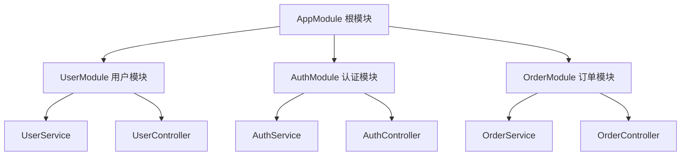
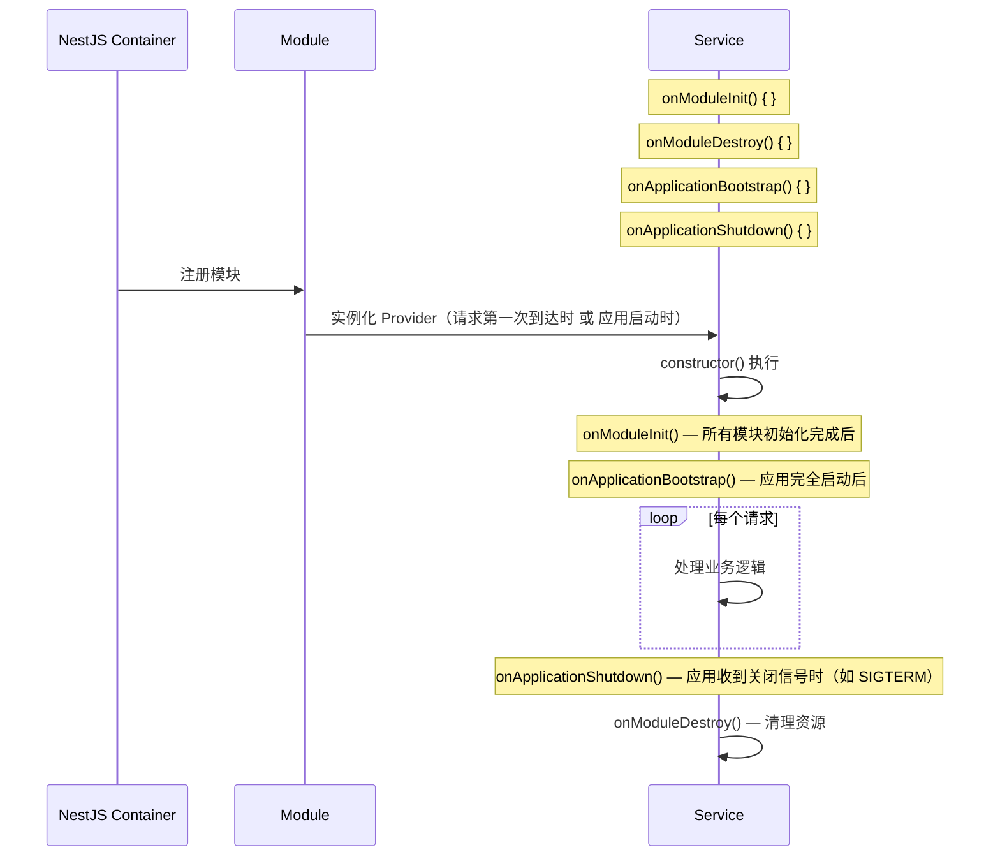
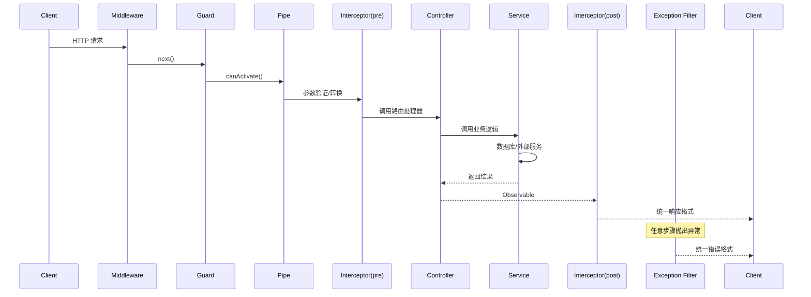

# 第二阶段：NestJS 核心概念与 HTTP 开发

> 本阶段目标：掌握 NestJS 三大核心（Module / Controller / Provider），理解依赖注入（AOP 切面编程思想），熟练使用中间件、拦截器、守卫、管道、异常过滤器，能够独立开发 RESTful API。

---

## 📐 阶段目标

| 目标 | 说明 |
|------|------|
| 理解 NestJS 设计理念 | 依赖注入、AOP 切面、模块化架构 |
| 掌握 Module 模块系统 | 根模块、功能模块、共享模块、动态模块 |
| 掌握 Controller 控制器 | 路由装饰器、请求/响应处理 |
| 掌握 Provider 依赖注入 | @Injectable、生命周期、控制反转 |
| 掌握请求生命周期 | Middleware → Guard → Pipe → Interceptor → Controller → Service |
| 熟练异常处理 | HttpException、Exception Filter、全局异常捕获 |

---

## 📂 示例代码目录

```
examples/stage2-nestjs-core/
├── 01-project-init/
│   ├── main.ts                    # 应用入口
│   ├── app.module.ts              # 根模块
│   └── nest-cli.json              # CLI 配置
├── 02-controller/
│   ├── user.controller.ts         # 用户控制器
│   ├── user.dto.ts                # 数据传输对象
│   └── response.interceptor.ts   # 统一响应格式
├── 03-provider-di/
│   ├── user.service.ts            # 用户服务（注入示例）
│   ├── config.service.ts          # 配置服务（@Injectable）
│   └── token.service.ts           # Token 服务
├── 04-middleware/
│   ├── logger.middleware.ts        # 日志中间件
│   └── auth.middleware.ts          # 鉴权中间件
├── 05-exception-filter/
│   ├── http-exception.filter.ts    # HTTP 异常过滤器
│   └── validation-exception.filter.ts
├── 06-guard/
│   ├── auth.guard.ts               # JWT 鉴权守卫
│   └── roles.guard.ts             # 角色权限守卫
├── 07-pipe/
│   ├── validation.pipe.ts         # DTO 验证管道
│   └── parse-int.pipe.ts          # 类型转换管道
└── 08-interceptor/
    ├── logging.interceptor.ts     # 日志记录拦截器
    └── transform.interceptor.ts   # 响应转换拦截器
```

---

## 1️⃣ NestJS 简介与项目初始化

### 1.1 NestJS 是什么

NestJS 是一个用于构建高效、可扩展的 Node.js 服务端应用的框架。它的核心理念：

```
┌─────────────────────────────────────────────────────────────┐
│                     NestJS 架构分层                          │
├─────────────────────────────────────────────────────────────┤
│                                                             │
│   Controllers（控制器层）  ←→  HTTP Request / Response     │
│         ↓                                                    │
│   Providers（服务层）     ←→  业务逻辑 + 依赖注入            │
│         ↓                                                    │
│   Modules（模块层）       ←→  功能边界 + 模块封装            │
│                                                             │
├─────────────────────────────────────────────────────────────┤
│   Middleware（中间件）   ←→  请求预处理                      │
│   Guard（守卫）          ←→  权限校验                        │
│   Pipe（管道）           ←→  数据转换/验证                    │
│   Interceptor（拦截器）  ←→  响应处理/AOP                    │
│   Exception Filter       ←→  异常处理                        │
└─────────────────────────────────────────────────────────────┘
```

### 1.2 快速初始化项目

```bash
# 全局安装 @nestjs/cli
npm install -g @nestjs/cli

# 创建新项目（选择 npm / yarn / pnpm）
nest new project-name

# 或指定包管理器
nest new project-name --package-manager pnpm

# 进入项目
cd project-name

# 启动开发服务器（热重载）
pnpm start:dev

# 生产构建
pnpm build

# 启动生产服务器
pnpm start:prod
```

### 1.3 项目目录结构

```
src/
├── main.ts                 # 应用入口
├── app.module.ts           # 根模块
├── app.controller.ts       # 根控制器（可选）
├── app.service.ts          # 根服务（可选）
├── user/                   # 用户功能模块
│   ├── user.module.ts
│   ├── user.controller.ts
│   ├── user.service.ts
│   ├── user.entity.ts      # 数据库实体
│   └── dto/                # 数据传输对象
│       ├── create-user.dto.ts
│       └── update-user.dto.ts
├── auth/                   # 认证模块
│   ├── auth.module.ts
│   ├── auth.controller.ts
│   ├── auth.service.ts
│   ├── jwt.strategy.ts     # Passport JWT 策略
│   └── guards/
│       └── jwt-auth.guard.ts
└── common/                 # 公共模块
    ├── decorators/
    ├── filters/
    ├── interceptors/
    ├── middleware/
    └── pipes/
```

### 1.4 main.ts 入口文件

```typescript
// examples/stage2-nestjs-core/01-project-init/main.ts

import { NestFactory } from '@nestjs/core';
import { AppModule } from './app.module';
import { HttpExceptionFilter } from './common/filters/http-exception.filter';
import { ValidationPipe } from '@nestjs/common';

async function bootstrap() {
  const app = await NestFactory.create(AppModule);

  // 全局前缀（所有路由加 /api 前缀）
  app.setGlobalPrefix('api');

  // 全局验证管道（自动验证 DTO）
  app.useGlobalPipes(
    new ValidationPipe({
      whitelist: true,         // 剔除不在 DTO 中的属性
      forbidNonWhitelisted: true, // 拒绝包含非法属性的请求
      transform: true,          // 自动类型转换（如 query 的 string → number）
      transformOptions: { enableImplicitConversion: true },
    }),
  );

  // 全局异常过滤器
  app.useGlobalFilters(new HttpExceptionFilter());

  // 全局跨域配置
  app.enableCors({
    origin: ['http://localhost:3000', 'https://myapp.com'],
    credentials: true,
  });

  // 监听端口
  const PORT = process.env.PORT || 3000;
  await app.listen(PORT);
  console.log(`应用已启动: http://localhost:${PORT}`);
}

bootstrap();
```

---

## 2️⃣ Module 模块系统

### 2.1 模块概念

NestJS 的模块用于**组织代码边界**，每个应用至少有一个根模块（AppModule）。



### 2.2 定义模块

```typescript
// examples/stage2-nestjs-core/01-project-init/app.module.ts

import { Module } from '@nestjs/common';
import { UserModule } from './user/user.module';
import { AuthModule } from './auth/auth.module';
import { ConfigModule } from '@nestjs/config';

@Module({
  imports: [
    // 导入其他模块（使本模块能访问它们的导出）
    UserModule,
    AuthModule,
    // 配置模块（支持 .env 文件注入）
    ConfigModule.forRoot({
      isGlobal: true,       // 全局注册，无需每个模块单独导入
      envFilePath: '.env',
    }),
  ],
  controllers: [],           // 本模块的控制器
  providers: [],            // 本模块的服务（组件）
  exports: [],               // 导出给其他模块使用的服务
})
export class AppModule {}
```

### 2.3 功能模块示例

```typescript
// user/user.module.ts

import { Module } from '@nestjs/common';
import { UserController } from './user.controller';
import { UserService } from './user.service';
import { PrismaService } from '../common/services/prisma.service';
import { JwtModule } from '@nestjs/jwt';

@Module({
  imports: [
    // JwtModule 注册（同步方式）
    JwtModule.register({
      global: true,
      secret: process.env.JWT_SECRET || 'secret',
      signOptions: { expiresIn: '7d' },
    }),
  ],
  controllers: [UserController],
  providers: [UserService, PrismaService],  // 可注入的服务
  exports: [UserService],                    // 允许其他模块导入 UserService
})
export class UserModule {}
```

### 2.4 动态模块（运行时配置）

```typescript
// 动态模块示例：数据库模块根据环境决定使用哪个数据库
import { Module, DynamicModule } from '@nestjs/common';
import { ConfigService } from '@nestjs/config';

@Module({})
export class DatabaseModule {
  static register(options: { type: 'mysql' | 'postgres' }): DynamicModule {
    return {
      module: DatabaseModule,
      providers: [
        {
          provide: 'DB_OPTIONS',
          useValue: options,
        },
        {
          provide: 'DB_CONNECTION',
          useFactory: async (config: ConfigService) => {
            // 根据 options.type 创建对应数据库连接
            return createConnection(options.type);
          },
          inject: [ConfigService],
        },
      ],
      exports: ['DB_CONNECTION'],
    };
  }
}

// 使用
@Module({
  imports: [
    DatabaseModule.register({ type: 'mysql' }),
  ],
})
export class AppModule {}
```

---

## 3️⃣ Controller 控制器

### 3.1 控制器基本结构

```typescript
// examples/stage2-nestjs-core/02-controller/user.controller.ts

import {
  Controller,
  Get,
  Post,
  Put,
  Delete,
  Body,
  Param,
  Query,
  Headers,
  HttpCode,
  HttpStatus,
  Res,
  Req,
} from '@nestjs/common';
import { Request, Response } from 'express';
import { CreateUserDto } from './dto/create-user.dto';
import { UpdateUserDto } from './dto/update-user.dto';
import { UserService } from './user.service';

@Controller('users')           // 路由前缀：/users
export class UserController {
  // 构造器注入（NestJS 自动实例化 UserService 并注入）
  constructor(private readonly userService: UserService) {}

  // ========== RESTful 路由示例 ==========

  // GET /users
  @Get()
  async findAll(@Query('page') page = 1, @Query('limit') limit = 10) {
    return this.userService.findAll({ page: +page, limit: +limit });
  }

  // GET /users/:id
  @Get(':id')
  async findOne(@Param('id') id: string) {
    return this.userService.findById(+id);
  }

  // POST /users
  @Post()
  @HttpCode(HttpStatus.CREATED)       // 状态码 201
  async create(@Body() createUserDto: CreateUserDto) {
    return this.userService.create(createUserDto);
  }

  // PUT /users/:id
  @Put(':id')
  async update(
    @Param('id') id: string,
    @Body() updateUserDto: UpdateUserDto,
  ) {
    return this.userService.update(+id, updateUserDto);
  }

  // DELETE /users/:id
  @Delete(':id')
  @HttpCode(HttpStatus.NO_CONTENT)   // 状态码 204
  async remove(@Param('id') id: string) {
    return this.userService.delete(+id);
  }

  // ========== 常用装饰器完整列表 ==========

  // @Req() / @Request()    — 获取原生 Express 请求对象
  // @Res() / @Response()   — 获取原生 Express 响应对象（慎用，会禁用 NestJS 响应处理）
  // @Next()                — 使用 Express next 函数
  // @Session()             — 获取会话对象
  // @Cookies(@Req() req)   — 获取 Cookie
  // @Headers(name?)        — 获取请求头
  // @Ip()                  — 获取客户端 IP
  // @HostParam()           — 获取 host 参数（用于路由如 @Get(':version/..'))
  // @ClientIp()            — 获取真实客户端 IP（配合代理）

  // ========== 响应处理方式 ==========

  // 方式1：返回对象/数组（NestJS 自动包装）
  @Get('simple')
  findSimple() {
    return [{ id: 1, name: '张三' }]; // → 自动序列化为 JSON
  }

  // 方式2：使用 @Res() 手动控制（会跳过 NestJS 生命周期）
  @Get('custom')
  findCustom(@Res() res: Response) {
    res.status(200).json({ data: [{ id: 1 }] });
  }

  // 方式3：使用 @Header() 设置响应头
  @Get('with-header')
  @Header('Cache-Control', 'no-store')
  findWithHeader() {
    return { id: 1 };
  }
}
```

### 3.2 DTO（数据传送对象）

```typescript
// examples/stage2-nestjs-core/02-controller/user.dto.ts

import { IsString, IsEmail, IsNumber, IsOptional, MinLength, MaxLength, IsEnum, Min, Max } from 'class-validator';
import { ApiProperty, ApiPropertyOptional } from '@nestjs/swagger'; // Swagger 文档注释

// ========== 创建用户 DTO ==========
export class CreateUserDto {
  @ApiProperty({ description: '用户名', example: '张三' })
  @IsString()
  @MinLength(2)
  @MaxLength(30)
  username: string;

  @ApiProperty({ description: '邮箱', example: 'zhangsan@example.com' })
  @IsEmail()
  email: string;

  @ApiProperty({ description: '密码', example: 'Password123' })
  @IsString()
  @MinLength(6)
  @MaxLength(20)
  password: string;

  @ApiPropertyOptional({ description: '昵称', example: '小张' })
  @IsString()
  @IsOptional()
  nickname?: string;

  @ApiPropertyOptional({ description: '年龄', example: 25 })
  @IsNumber()
  @IsOptional()
  @Min(0)
  @Max(150)
  age?: number;

  @ApiPropertyOptional({ description: '角色', enum: ['user', 'admin', 'vip'] })
  @IsEnum(['user', 'admin', 'vip'])
  @IsOptional()
  role?: 'user' | 'admin' | 'vip';
}

// ========== 更新用户 DTO ==========
export class UpdateUserDto {
  @ApiPropertyOptional({ description: '昵称' })
  @IsString()
  @IsOptional()
  nickname?: string;

  @ApiPropertyOptional({ description: '年龄' })
  @IsNumber()
  @IsOptional()
  age?: number;
}
```

### 3.3 统一响应格式（拦截器实现）

```typescript
// examples/stage2-nestjs-core/02-controller/response.interceptor.ts

import {
  Injectable,
  NestInterceptor,
  ExecutionContext,
  CallHandler,
} from '@nestjs/common';
import { Observable } from 'rxjs';
import { map } from 'rxjs/operators';

@Injectable()
export class TransformInterceptor implements NestInterceptor {
  intercept(context: ExecutionContext, next: CallHandler): Observable<any> {
    return next.handle().pipe(
      map((data) => ({
        code: 0,
        message: 'success',
        data,
        timestamp: new Date().toISOString(),
        path: context.switchToHttp().getRequest().url,
      })),
    );
  }
}

// 使用方式：在模块中注册为全局拦截器
// app.useGlobalInterceptors(new TransformInterceptor());

// 响应格式：
// {
//   "code": 0,
//   "message": "success",
//   "data": [...],
//   "timestamp": "2026-04-18T12:00:00.000Z",
//   "path": "/api/users"
// }
```

---

## 4️⃣ Provider 与依赖注入

### 4.1 什么是 Provider

Provider 是 NestJS 的核心概念，本质上是**可以通过依赖注入**自动实例化的服务类。

```
┌──────────────────────────────────────────────────────┐
│                   依赖注入（DI）流程                   │
├──────────────────────────────────────────────────────┤
│                                                       │
│  UserController                                      │
│       ↓ constructor(userService: UserService)        │
│       ↓                                              │
│  NestJS Container（IoC 容器）                        │
│       ↓ 查找 UserService 的 provider                 │
│       ↓ 发现 @Injectable() 装饰器                     │
│       ↓ 实例化（单例模式，默认）                       │
│       ↓ 注入到 UserController                         │
│                                                       │
└──────────────────────────────────────────────────────┘
```

### 4.2 定义 Provider（@Injectable）

```typescript
// examples/stage2-nestjs-core/03-provider-di/user.service.ts

import { Injectable, NotFoundException } from '@nestjs/common';
import { PrismaService } from '../../common/services/prisma.service';

@Injectable()  // 装饰器：标记此类可被 DI 容器管理
export class UserService {
  // 构造器注入（推荐方式）
  constructor(private readonly prisma: PrismaService) {}

  // ========== CRUD 操作 ==========

  async findAll(params: { page: number; limit: number }) {
    const { page, limit } = params;
    const skip = (page - 1) * limit;

    const [users, total] = await Promise.all([
      this.prisma.user.findMany({
        skip,
        take: limit,
        orderBy: { createdAt: 'desc' },
      }),
      this.prisma.user.count(),
    ]);

    return {
      list: users,
      pagination: {
        page,
        limit,
        total,
        totalPages: Math.ceil(total / limit),
      },
    };
  }

  async findById(id: number) {
    const user = await this.prisma.user.findUnique({ where: { id } });
    if (!user) {
      throw new NotFoundException(`用户 ID=${id} 不存在`);
    }
    return user;
  }

  async create(dto: { username: string; email: string; password: string }) {
    return this.prisma.user.create({
      data: dto,
    });
  }

  async update(id: number, dto: { nickname?: string; age?: number }) {
    await this.findById(id); // 先检查是否存在
    return this.prisma.user.update({
      where: { id },
      data: dto,
    });
  }

  async delete(id: number) {
    await this.findById(id);
    return this.prisma.user.delete({ where: { id } });
  }
}
```

### 4.3 构造器注入 vs 属性注入

```typescript
// ========== 构造器注入（推荐）==========
@Injectable()
export class UserService {
  constructor(
    private readonly prisma: PrismaService,
    private readonly jwtService: JwtService,
    private readonly configService: ConfigService,
  ) {}
}

// ========== 属性注入（较少使用）==========
@Injectable()
export class UserService {
  @Inject(JWT_SERVICE)
  private readonly jwtService: JwtService;
  // 适用于测试时需要 mock 的场景
}

// ========== 可选注入 ==========
@Injectable()
export class UserService {
  constructor(
    @Optional() @Inject(LOGGER_SERVICE) private readonly logger: ILogger | null,
  ) {
    // logger 可能为 null（未注册时）
  }
}
```

### 4.4 Provider 多种注册方式

```typescript
// ========== 方式1：类名（最常用）==========
providers: [UserService];

// ========== 方式2：手动提供 Token + Factory ==========
providers: [
  {
    provide: 'CACHE_MANAGER',
    useFactory: async (config: ConfigService) => {
      const store = await createCacheStore(config);
      return store;
    },
    inject: [ConfigService],       // 依赖注入的 token 列表
  },
];

// ========== 方式3：手动提供 Token + 使用类 ==========
providers: [
  {
    provide: 'IUserService',
    useClass: UserService,         // 接口 → 实现类映射
  },
];

// ========== 方式4：现有实例 ==========
providers: [
  {
    provide: 'EXTERNAL_SERVICE',
    useValue: new ExternalService(apiKey),
  },
];

// ========== 方式5：别名（useExisting）==========
providers: [
  { provide: 'AliasedService', useExisting: UserService },
  UserService,
];
```

### 4.5 模块间共享 Provider

```typescript
// 通过 exports 导出，import 导入，实现跨模块共享

// user.module.ts
@Module({
  providers: [UserService],
  exports: [UserService],  // 导出后，其他模块可注入
})
export class UserModule {}

// auth.module.ts
@Module({
  imports: [UserModule],    // 导入后，AuthService 可注入 UserService
})
export class AuthModule {
  constructor(private userService: UserService) {}
}
```

### 4.6 Provider 生命周期



```typescript
@Injectable()
export class UserService implements OnModuleInit, OnModuleDestroy, OnApplicationBootstrap {
  constructor() {}

  onModuleInit() {
    // 当该模块的 Provider 被首次实例化时调用
    console.log('UserService 初始化');
  }

  onModuleDestroy() {
    // 应用关闭时调用（可关闭数据库连接等）
    console.log('UserService 销毁');
  }

  onApplicationBootstrap() {
    // 所有模块 init 完成后调用，适合启动定时任务
    console.log('应用完全启动');
  }
}
```

---

## 5️⃣ 中间件（Middleware）

### 5.1 中间件执行时机

```
请求 → 中间件1 → 中间件2 → Guard → Pipe → Interceptor → Controller → Service → 数据库
       ←                                    ←
       响应 ← 中间件2 ← 中间件1 ←
```

### 5.2 定义中间件

```typescript
// examples/stage2-nestjs-core/04-middleware/logger.middleware.ts

import { Injectable, NestMiddleware, Logger } from '@nestjs/common';
import { Request, Response, NextFunction } from 'express';

@Injectable()
export class LoggerMiddleware implements NestMiddleware {
  private readonly logger = new Logger('HTTP');

  use(req: Request, res: Response, next: NextFunction) {
    const { method, originalUrl, ip } = req;
    const userAgent = req.get('user-agent') || '';
    const start = Date.now();

    // 响应结束时的回调
    res.on('finish', () => {
      const { statusCode } = res;
      const contentLength = res.get('content-length');
      const duration = Date.now() - start;

      this.logger.log(
        `${method} ${originalUrl} ${statusCode} ${contentLength || 0}b - ${duration}ms - ${ip} - ${userAgent}`,
      );
    });

    next();
  }
}

// 注册中间件
// app.module.ts
@Module({
  // ...
})
export class AppModule implements NestModule {
  configure(consumer: MiddlewareConsumer) {
    consumer
      .apply(LoggerMiddleware)        // 应用中间件
      .forRoutes('*');              // 作用于所有路由
    // .forRoutes(UserController)   // 或指定控制器
    // .exclude('auth/*')            // 排除某些路由
  }
}
```

### 5.3 函数式中间件（无状态中间件）

```typescript
// 无需 @Injectable()，直接使用函数
export function AuthMiddleware(req: Request, res: Response, next: NextFunction) {
  const token = req.headers.authorization?.replace('Bearer ', '');
  if (!token) {
    return res.status(401).json({ message: '未登录' });
  }
  next();
}

// 注册
consumer.apply(AuthMiddleware).forRoutes('*');
```

### 5.4 全局中间件

```typescript
// main.ts
const app = await NestFactory.create(AppModule);

// 全局中间件（所有路由生效）
app.use((req, res, next) => {
  console.log('全局中间件:', req.path);
  next();
});
```

---

## 6️⃣ 异常过滤器（Exception Filter）

### 6.1 NestJS 内置异常类

```typescript
// NestJS 提供所有标准 HTTP 异常
throw new BadRequestException('参数错误');
throw new UnauthorizedException('未登录');
throw new ForbiddenException('无权限');
throw new NotFoundException('资源不存在');
throw new InternalServerErrorException('服务器内部错误');
throw new HttpException('自定义消息', HttpStatus.BAD_GATEWAY);
```

### 6.2 自定义全局异常过滤器

```typescript
// examples/stage2-nestjs-core/05-exception-filter/http-exception.filter.ts

import {
  ExceptionFilter,
  Catch,
  ArgumentsHost,
  HttpException,
  HttpStatus,
  Logger,
} from '@nestjs/common';
import { Request, Response } from 'express';

@Catch()                          // @Catch() 不带参数 = 捕获所有异常
export class HttpExceptionFilter implements ExceptionFilter {
  private readonly logger = new Logger(HttpExceptionFilter.name);

  catch(exception: unknown, host: ArgumentsHost) {
    const ctx = host.switchToHttp();
    const response = ctx.getResponse<Response>();
    const request = ctx.getRequest<Request>();

    let status: number;
    let message: string | object;

    if (exception instanceof HttpException) {
      status = exception.getStatus();
      const exceptionResponse = exception.getResponse();
      message = typeof exceptionResponse === 'string'
        ? exceptionResponse
        : (exceptionResponse as any).message || exceptionResponse;
    } else {
      // 非 HttpException（代码 bug、外部错误）
      status = HttpStatus.INTERNAL_SERVER_ERROR;
      message = '服务器内部错误，请稍后重试';

      // 生产环境应上报 Sentry
      this.logger.error(
        `未捕获异常: ${exception instanceof Error ? exception.message : exception}`,
        exception instanceof Error ? exception.stack : '',
      );
    }

    const errorResponse = {
      code: status,
      message,
      timestamp: new Date().toISOString(),
      path: request.url,
      method: request.method,
    };

    response.status(status).json(errorResponse);
  }
}

// 使用方式：app.useGlobalFilters(new HttpExceptionFilter());
```

### 6.3 特定异常过滤器

```typescript
// 只捕获 ValidationError（来自 class-validator）
@Catch(ValidationError)
export class ValidationExceptionFilter implements ExceptionFilter {
  catch(exception: ValidationError[], host: ArgumentsHost) {
    const response = host.switchToHttp().getResponse<Response>();
    response.status(HttpStatus.BAD_REQUEST).json({
      code: 400,
      message: '参数验证失败',
      errors: exception.map(e => ({
        field: e.property,
        constraints: e.constraints,
      })),
    });
  }
}
```

---

## 7️⃣ 守卫（Guard）

### 7.1 守卫概念

守卫在**路由处理器之前**执行，用于**权限校验**。返回一个 boolean（或 boolean Observable）决定是否允许继续。

```
请求 → Middleware → Guard → Pipe → Interceptor → Controller
                    ↑
              这里执行权限校验
```

### 7.2 JWT 鉴权守卫

```typescript
// examples/stage2-nestjs-core/06-guard/jwt-auth.guard.ts

import {
  Injectable,
  CanActivate,
  ExecutionContext,
  UnauthorizedException,
} from '@nestjs/common';
import { JwtService } from '@nestjs/jwt';
import { Request } from 'express';

@Injectable()
export class JwtAuthGuard implements CanActivate {
  constructor(private readonly jwtService: JwtService) {}

  async canActivate(context: ExecutionContext): Promise<boolean> {
    const request = context.switchToHttp().getRequest<Request>();
    const token = this.extractTokenFromHeader(request);

    if (!token) {
      throw new UnauthorizedException('缺少认证 Token');
    }

    try {
      const payload = await this.jwtService.verifyAsync(token);
      // 将用户信息挂载到 request 对象上，供后续使用
      (request as any).user = payload;
    } catch {
      throw new UnauthorizedException('Token 无效或已过期');
    }

    return true;
  }

  private extractTokenFromHeader(request: Request): string | undefined {
    const authHeader = request.headers.authorization;
    if (!authHeader) return undefined;

    const [type, token] = authHeader.split(' ');
    return type === 'Bearer' ? token : undefined;
  }
}

// 使用：添加在控制器或路由上
@Controller('users')
export class UserController {
  @Get('profile')
  @UseGuards(JwtAuthGuard)           // 局部守卫
  getProfile(@Request() req) {
    return req.user;
  }
}

// 全局守卫（所有路由生效）
// app.module.ts
{
  providers: [
    {
      provide: APP_GUARD,
      useClass: JwtAuthGuard,
    },
  ],
}
```

### 7.3 角色权限守卫

```typescript
// examples/stage2-nestjs-core/06-guard/roles.guard.ts

import { Injectable, CanActivate, SetMetadata } from '@nestjs/common';
import { Reflector } from '@nestjs/core';

// 角色元数据 Key
export const ROLES_KEY = 'roles';

// 角色装饰器
export const Roles = (...roles: string[]) => SetMetadata(ROLES_KEY, roles);

@Injectable()
export class RolesGuard implements CanActivate {
  constructor(private reflector: Reflector) {}

  canActivate(context: ExecutionContext): boolean {
    const requiredRoles = this.reflector.getAllAndOverride<string[]>(ROLES_KEY, [
      context.getHandler(),
      context.getClass(),
    ]);

    if (!requiredRoles) {
      return true; // 没有配置角色要求，允许访问
    }

    const { user } = context.switchToHttp().getRequest();
    return requiredRoles.some(role => user?.roles?.includes(role));
  }
}

// 使用
@Controller('admin')
@UseGuards(JwtAuthGuard, RolesGuard)
export class AdminController {
  @Get('users')
  @Roles('admin')           // 只有 admin 角色可访问
  manageUsers() {
    return '用户管理面板';
  }

  @Get('settings')
  @Roles('admin', 'super')  // admin 或 super 角色可访问
  manageSettings() {
    return '系统设置';
  }
}
```

---

## 8️⃣ 管道（Pipe）

### 8.1 管道概念

管道在**控制器方法参数绑定之前**执行，用于**数据转换**或**数据验证**。

```
请求 → Middleware → Guard → Pipe(参数转换) → Pipe(参数验证) → Controller
```

### 8.2 内置管道

```typescript
import { ParseIntPipe, DefaultValuePipe, ParseBoolPipe, ParseArrayPipe, ParseUUIDPipe } from '@nestjs/common';

// @Param('id') — URL 参数
@Get(':id')
findById(
  @Param('id', ParseIntPipe) id: number, // 自动将字符串 '123' 转为数字 123
) {}

// 如果类型转换失败，自动抛出 400 Bad Request

// @Query 参数
@Get()
findAll(
  @Query('page', new DefaultValuePipe(1), ParseIntPipe) page: number,
  @Query('active', ParseBoolPipe) active: boolean, // 'true'/'false' → boolean
) {}

// @Body 参数
@Post()
create(
  @Body('name', ParseUUIDPipe) name: string, // 验证是否为合法 UUID
) {}
```

### 8.3 自定义验证管道

```typescript
// examples/stage2-nestjs-core/07-pipe/validation.pipe.ts

import {
  PipeTransform,
  Injectable,
  ArgumentMetadata,
  BadRequestException,
} from '@nestjs/common';

@Injectable()
export class ValidatePipe implements PipeTransform {
  // value = 当前参数的值
  // metadata = 参数的元数据（类型、名称、装饰器等）
  transform(value: any, metadata: ArgumentMetadata) {
    const { type, metatype } = metadata;

    // 只验证 body 参数
    if (type === 'body' && metatype) {
      // 使用 class-transformer + class-validator 进行验证
      // 通常直接用 ValidationPipe 代替，这里演示自定义逻辑
      if (typeof value.id !== 'undefined' && !Number.isInteger(value.id)) {
        throw new BadRequestException('id 必须是整数');
      }
    }

    return value;
  }
}

// ========== 完整验证管道（集成 class-validator）==========
import { PipeTransform, Injectable, ArgumentMetadata } from '@nestjs/common';
import { validate } from 'class-validator';
import { plainToInstance } from 'class-transformer';

@Injectable()
export class CustomValidationPipe implements PipeTransform<any> {
  async transform(value: any, { metatype, type }: ArgumentMetadata) {
    if (type !== 'body') return value;

    const object = plainToInstance(metatype, value);
    const errors = await validate(object);

    if (errors.length > 0) {
      const messages = errors.flatMap(e =>
        Object.values(e.constraints || {})
      );
      throw new BadRequestException(messages);
    }

    return object;
  }
}
```

---

## 9️⃣ 拦截器（Interceptor）

### 9.1 拦截器概念

拦截器在**请求处理器前后**执行，用于 AOP 切面编程：

- 在响应前修改响应内容
- 记录请求耗时
- 缓存响应
- 统一错误处理

```
请求 → Guard → Pipe → Interceptor.pre → Controller → Service
                                              ↓
响应 ← Interceptor.post ← ← ← ← ← ← ← ← ← ← ← ←
```

### 9.2 日志记录拦截器

```typescript
// examples/stage2-nestjs-core/08-interceptor/logging.interceptor.ts

import {
  Injectable,
  NestInterceptor,
  ExecutionContext,
  CallHandler,
  Logger,
} from '@nestjs/common';
import { Observable } from 'rxjs';
import { tap } from 'rxjs/operators';

@Injectable()
export class LoggingInterceptor implements NestInterceptor {
  private readonly logger = new Logger('HTTP');

  intercept(context: ExecutionContext, next: CallHandler): Observable<any> {
    const request = context.switchToHttp().getRequest();
    const { method, url, body } = request;
    const now = Date.now();

    this.logger.log(`➡️  ${method} ${url} - Body: ${JSON.stringify(body)}`);

    return next.handle().pipe(
      tap({
        next: (data) => {
          this.logger.log(`⬅️  ${method} ${url} - ${Date.now() - now}ms`);
        },
        error: (error) => {
          this.logger.error(`❌  ${method} ${url} - ${Date.now() - now}ms - ${error.message}`);
        },
      }),
    );
  }
}
```

### 9.3 响应转换拦截器

```typescript
// examples/stage2-nestjs-core/08-interceptor/transform.interceptor.ts

import {
  Injectable,
  NestInterceptor,
  ExecutionContext,
  CallHandler,
} from '@nestjs/common';
import { Observable } from 'rxjs';
import { map } from 'rxjs/operators';

@Injectable()
export class TransformInterceptor implements NestInterceptor {
  intercept(context: ExecutionContext, next: CallHandler): Observable<any> {
    return next.handle().pipe(
      map((data) => ({
        code: 0,
        message: 'success',
        data,
        timestamp: new Date().toISOString(),
      })),
    );
  }
}

// 使用：全局注册
// app.useGlobalInterceptors(new TransformInterceptor());

// 响应格式统一变为：
// { code: 0, message: 'success', data: {...}, timestamp: '...' }
```

### 9.4 缓存拦截器（简单版）

```typescript
import {
### 9.4 缓存拦截器（简单版）

```typescript
import {
  Injectable,
  NestInterceptor,
  ExecutionContext,
  CallHandler,
} from '@nestjs/common';
import { Observable, of } from 'rxjs';
import { tap } from 'rxjs/operators';

interface CacheConfig {
  ttl: number; // 缓存有效期（秒）
}

@Injectable()
export class CacheInterceptor implements NestInterceptor {
  private cache = new Map<string, { data: any; expiry: number }>();

  intercept(context: ExecutionContext, next: CallHandler): Observable<any> {
    const request = context.switchToHttp().getRequest();
    const key = `${request.method}:${request.url}`;
    const cached = this.cache.get(key);

    if (cached && cached.expiry > Date.now()) {
      return of(cached.data); // 返回缓存数据
    }

    return next.handle().pipe(
      tap((data) => {
        this.cache.set(key, { data, expiry: Date.now() + 60 * 1000 }); // 缓存 60 秒
      }),
    );
  }
}
```

---

## 🔟 请求完整生命周期

```
┌────────────────────────────────────────────────────────────────────┐
│                        请求生命周期（完整流程）                        │
├────────────────────────────────────────────────────────────────────┤
│                                                                     │
│   1. 请求进入                                                       │
│            ↓                                                        │
│   2. Middleware（全局中间件）                                        │
│            ↓                                                        │
│   3. Middleware（路由级中间件）                                       │
│            ↓                                                        │
│   4. Guard（路由守卫）— 检查认证/权限                                 │
│            ↓                                                        │
│   5. Pipe（全局管道）— 参数转换/验证                                 │
│            ↓                                                        │
│   6. Pipe（参数管道）— 针对特定参数的管道                             │
│            ↓                                                        │
│   7. Interceptor（前置逻辑）— before route handler                  │
│            ↓                                                        │
│   8. Controller — 路由处理器                                         │
│            ↓                                                        │
│   9. Service — 业务逻辑                                             │
│            ↓                                                        │
│  10. Database / External API                                        │
│            ↓                                                        │
│  11. Service — 返回结果                                              │
│            ↓                                                        │
│  12. Interceptor（后置逻辑）— after route handler                   │
│            ↓                                                        │
│  13. Exception Filter — 异常处理                                    │
│            ↓                                                        │
│  14. Client ← 响应                                                  │
│                                                                     │
└────────────────────────────────────────────────────────────────────┘
```

---

## 1️⃣1️⃣ NestJS 请求流程图（Mermaid）



---

## 1️⃣2️⃣ 常用命令速查

```bash
# ========== NestJS CLI 命令 ==========
nest new project-name              # 创建新项目
nest generate module user          # 生成 user 模块
nest generate controller user      # 生成 user 控制器
nest generate service user         # 生成 user 服务
nest generate resource user        # 生成完整 CRUD 资源（REST 或 GraphQL）
nest generate guard auth/jwt       # 生成守卫
nest generate pipe common/validate # 生成管道
nest generate interceptor logging  # 生成拦截器
nest generate filter common/http   # 生成异常过滤器
nest generate decorator roles      # 生成自定义装饰器
nest build                        # 生产构建
nest start                        # 启动生产服务
nest start:dev                    # 开发模式（热重载）
nest start:prod                   # 生产模式
nest info                         # 查看 NestJS 环境信息
```

---

## 1️⃣3️⃣ 练习题

### 练习 1：模块设计
设计一个 `ArticleModule`，包含文章 CRUD 功能，包含 `ArticleController`、`ArticleService`、`CreateArticleDto`、`UpdateArticleDto`，并注册到 `AppModule`。

### 练习 2：守卫 + 装饰器
实现一个 `RolesGuard`，支持自定义 `@Roles()` 装饰器限制接口访问权限。

### 练习 3：拦截器
实现一个 `TimingInterceptor`，记录每个请求的处理时间（从进入 Controller 到响应发出）。

### 练习 4：异常过滤器
实现一个 `AllExceptionsFilter`，在生产环境中将详细错误信息（stack trace）隐藏，只返回通用错误消息。

---

## 1️⃣4️⃣ 本阶段知识点速览

| 概念 | 作用 | 执行时机 |
|------|------|---------|
| **Module** | 代码组织边界，模块化封装 | 应用启动时注册 |
| **Controller** | 处理 HTTP 请求/响应，路由分发 | 请求匹配路由后 |
| **Provider** | 业务逻辑，依赖注入的服务 | 按需实例化 |
| **Middleware** | 请求预处理（日志、请求体解析） | 路由匹配前 |
| **Guard** | 权限校验，返回 boolean | 路由匹配后，管道前 |
| **Pipe** | 数据转换/验证 | 参数绑定前 |
| **Interceptor** | AOP 切面（统一响应、日志） | 请求处理前后 |
| **Exception Filter** | 统一异常处理 | 任意代码抛出异常时 |

---

## 🔗 相关资源

- [NestJS 官方文档 - Controllers](https://docs.nestjs.com/controllers)
- [NestJS 官方文档 - Providers](https://docs.nestjs.com/providers)
- [NestJS 官方文档 - Modules](https://docs.nestjs.com/modules)
- [NestJS 官方文档 - Middleware](https://docs.nestjs.com/middleware)
- [NestJS 官方文档 - Guards](https://docs.nestjs.com/guards)
- [NestJS 官方文档 - Pipes](https://docs.nestjs.com/pipes)
- [NestJS 官方文档 - Interceptors](https://docs.nestjs.com/interceptors)
- [NestJS 官方文档 - Exception Filters](https://docs.nestjs.com/exception-filters)

---

**下一阶段预告**：[第三阶段：Java 全家桶与 NestJS 技术对标](./第三阶段_Java对标NestJS.md)

> 以 Java 开发者熟悉的视角，系统对标 Spring Boot 生态与 NestJS 的对应关系，快速理解框架映射，消除技术迁移焦虑。
