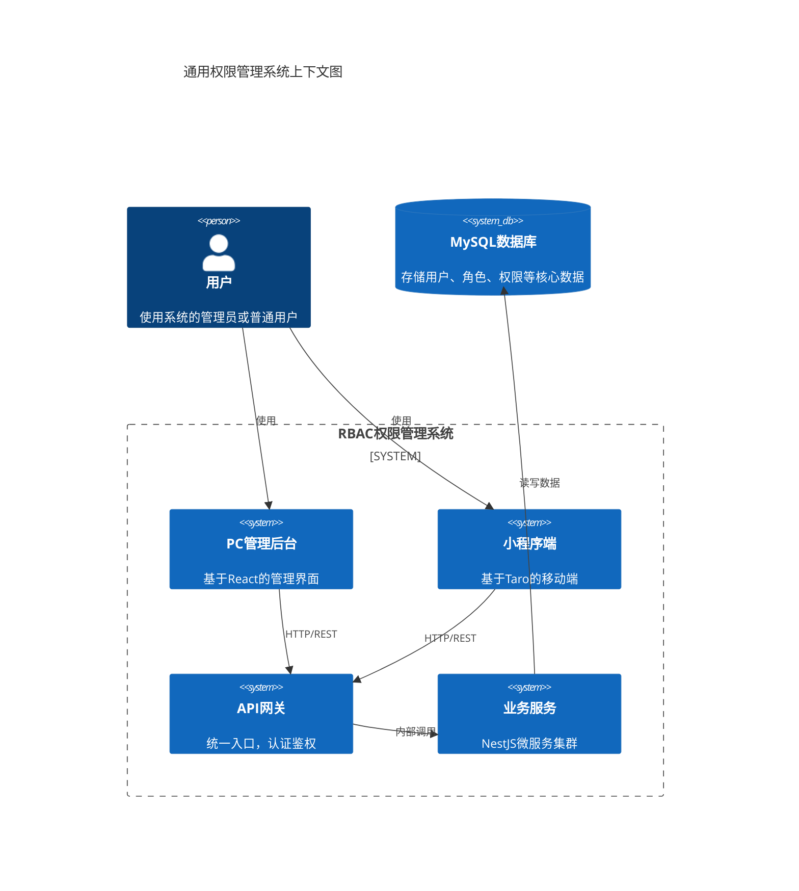
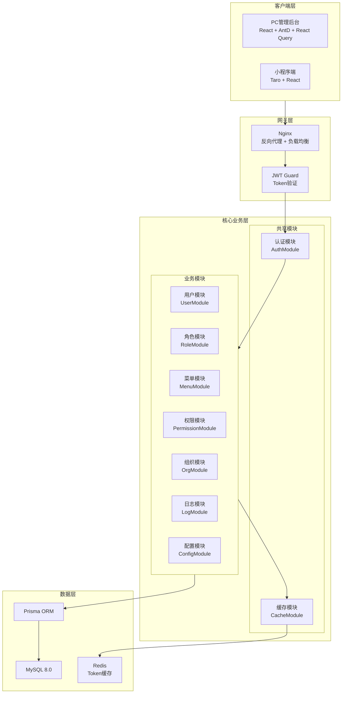
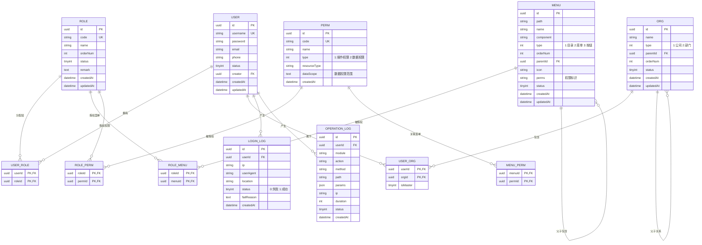
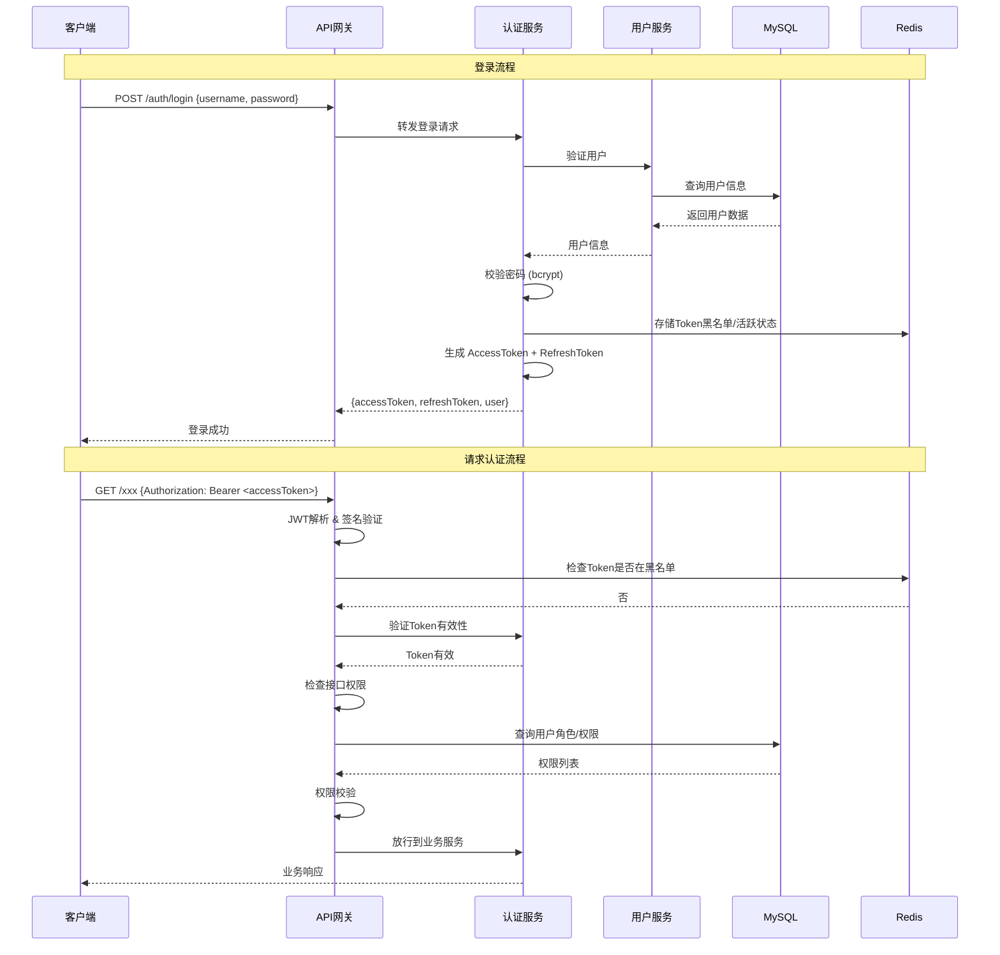
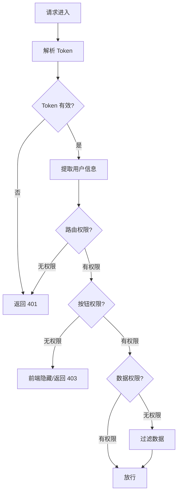

# 通用权限管理后台系统（RBAC）技术方案

## 目录
1. [系统架构图](#1-系统架构图)
2. [数据库设计（Prisma Schema）](#2-数据库设计prisma-schema)
3. [模块划分](#3-模块划分)
4. [目录结构](#4-目录结构)
5. [核心API设计](#5-核心api设计)
6. [认证授权流程](#6-认证授权流程)

---

## 1. 系统架构图

### 1.1 C4 架构概览图



### 1.2 系统组件架构图



### 1.3 权限数据模型关系图



---

## 2. 数据库设计（Prisma Schema）

```prisma
// prisma/schema.prisma

generator client {
  provider = "prisma-client-js"
}

datasource db {
  provider = "mysql"
  url      = env("DATABASE_URL")
}

// =============================================
// 基础表
// =============================================

/// 用户表
model User {
  id            String    @id @default(uuid())
  username      String    @unique @db.VarChar(50)
  password      String    @db.VarChar(255)
  nickname      String    @db.VarChar(50)
  email         String?   @db.VarChar(100)
  phone         String?   @db.VarChar(20)
  avatar        String?   @db.VarChar(255)
  status        Int       @default(1) // 1:正常 0:禁用
  lastLoginAt   DateTime?
  lastLoginIp   String?   @db.VarChar(50)
  creatorId     String?
  createdAt     DateTime  @default(now())
  updatedAt     DateTime  @updatedAt

  // 关联
  creator       User?     @relation("UserCreator", fields: [creatorId], references: [id])
  children      User[]    @relation("UserCreator")
  roles         UserRole[]
  orgs          UserOrg[]
  loginLogs     LoginLog[]
  operationLogs OperationLog[]
  createdMenus  Menu[]    @relation("MenuCreator")
  createdRoles  Role[]    @relation("RoleCreator")
  createdOrgs   Org[]     @relation("OrgCreator")

  @@index([username])
  @@index([status])
}

/// 角色表
model Role {
  id        String   @id @default(uuid())
  code      String   @unique @db.VarChar(50)
  name      String   @db.VarChar(50)
  orderNum  Int      @default(0)
  status    Int      @default(1) // 1:正常 0:禁用
  remark    String?  @db.Text
  creatorId String?
  createdAt DateTime @default(now())
  updatedAt DateTime @updatedAt

  // 关联
  creator   User?      @relation("RoleCreator", fields: [creatorId], references: [id])
  users     UserRole[]
  menus     RoleMenu[]
  perms     RolePerm[]

  @@index([code])
  @@index([status])
}

/// 菜单表（树形结构）
model Menu {
  id        String   @id @default(uuid())
  path      String   @db.VarChar(255)
  name      String   @db.VarChar(50)
  component String?  @db.VarChar(255)
  redirect  String?  @db.VarChar(255)
  type      Int      // 1:目录 2:菜单 3:按钮
  orderNum  Int      @default(0)
  parentId  String?
  icon      String?  @db.VarChar(50)
  perms     String?  @db.VarChar(100) // 权限标识，如: system:user:list
  isCache   Boolean  @default(false)  // 是否缓存
  isHidden  Boolean  @default(false)  // 是否隐藏
  isAffix   Boolean  @default(false)  // 是否固定
  status    Int      @default(1) // 1:正常 0:禁用
  creatorId String?
  createdAt DateTime @default(now())
  updatedAt DateTime @updatedAt

  // 关联
  parent        Menu?      @relation("MenuParent", fields: [parentId], references: [id])
  children      Menu[]     @relation("MenuParent")
  creator       User?      @relation("MenuCreator", fields: [creatorId], references: [id])
  roles         RoleMenu[]
  perms         MenuPerm[]

  @@index([parentId])
  @@index([type])
  @@index([status])
}

/// 权限表（按钮权限+数据权限）
model Permission {
  id           String   @id @default(uuid())
  code         String   @unique @db.VarChar(100) // 权限标识
  name         String   @db.VarChar(50)          // 权限名称
  type         Int      // 1:操作权限 2:数据权限
  resourceType String?  @db.VarChar(50)          // 资源类型: api, menu, button, data
  dataScope    String?  @db.Text                 // 数据权限范围 SQL 条件
  dataScopeType Int     @default(1)               // 1:全部 2:本部门及以下 3:本部门 4:仅本人 5:自定义
  status       Int      @default(1)
  createdAt    DateTime @default(now())
  updatedAt    DateTime @updatedAt

  // 关联
  roles        RolePerm[]
  menus        MenuPerm[]

  @@index([type])
  @@index([code])
}

/// 组织表（公司/部门树形结构）
model Org {
  id        String   @id @default(uuid())
  name      String   @db.VarChar(50)
  type      Int      // 1:公司 2:部门
  code      String?  @db.VarChar(50)
  parentId  String?
  orderNum  Int      @default(0)
  status    Int      @default(1)
  creatorId String?
  createdAt DateTime @default(now())
  updatedAt DateTime @updatedAt

  // 关联
  parent    Org?      @relation("OrgParent", fields: [parentId], references: [id])
  children  Org[]     @relation("OrgParent")
  creator   User?     @relation("OrgCreator", fields: [creatorId], references: [id])
  users     UserOrg[]

  @@index([parentId])
  @@index([type])
  @@index([status])
}

/// 系统配置表
model SystemConfig {
  id        String   @id @default(uuid())
  group     String   @db.VarChar(50)  // 配置分组
  key       String   @db.VarChar(100) // 配置键
  value     String   @db.Text          // 配置值
  type      String   @db.VarChar(20)   // string, number, boolean, json
  label     String?  @db.VarChar(100)  // 配置名称
  remark    String?  @db.VarChar(255)  // 配置说明
  orderNum  Int      @default(0)
  status    Int      @default(1)
  createdAt DateTime @default(now())
  updatedAt DateTime @updatedAt

  @@unique([group, key])
  @@index([group])
}

// =============================================
// 关联表
// =============================================

/// 用户-角色关联表
model UserRole {
  userId   String
  roleId   String
  createdAt DateTime @default(now())

  user User @relation(fields: [userId], references: [id], onDelete: Cascade)
  role Role @relation(fields: [roleId], references: [id], onDelete: Cascade)

  @@id([userId, roleId])
}

/// 用户-组织关联表
model UserOrg {
  userId   String
  orgId    String
  isMaster Boolean @default(false) // 是否为主部门
  createdAt DateTime @default(now())

  user User @relation(fields: [userId], references: [id], onDelete: Cascade)
  org  Org  @relation(fields: [orgId], references: [id], onDelete: Cascade)

  @@id([userId, orgId])
}

/// 角色-菜单关联表
model RoleMenu {
  roleId   String
  menuId   String
  createdAt DateTime @default(now())

  role Role @relation(fields: [roleId], references: [id], onDelete: Cascade)
  menu Menu @relation(fields: [menuId], references: [id], onDelete: Cascade)

  @@id([roleId, menuId])
}

/// 角色-权限关联表
model RolePerm {
  roleId   String
  permId   String
  createdAt DateTime @default(now())

  role Role       @relation(fields: [roleId], references: [id], onDelete: Cascade)
  perm Permission @relation(fields: [permId], references: [id], onDelete: Cascade)

  @@id([roleId, permId])
}

/// 菜单-权限关联表（按钮对应的权限）
model MenuPerm {
  menuId   String
  permId   String
  createdAt DateTime @default(now())

  menu Menu       @relation(fields: [menuId], references: [id], onDelete: Cascade)
  perm Permission @relation(fields: [permId], references: [id], onDelete: Cascade)

  @@id([menuId, permId])
}

// =============================================
// 日志表
// =============================================

/// 登录日志表
model LoginLog {
  id        String   @id @default(uuid())
  userId    String?
  username  String   @db.VarChar(50)
  ip        String?  @db.VarChar(50)
  address   String?  @db.VarChar(255)
  userAgent String?  @db.VarChar(500)
  os        String?  @db.VarChar(50)
  browser   String?  @db.VarChar(50)
  status    Int      // 0:失败 1:成功
  failReason String? @db.VarChar(255)
  loginAt   DateTime @default(now())

  user User? @relation(fields: [userId], references: [id])

  @@index([userId])
  @@index([loginAt])
  @@index([status])
}

/// 操作日志表
model OperationLog {
  id         String   @id @default(uuid())
  userId     String?
  username   String   @db.VarChar(50)
  module     String?  @db.VarChar(50)  // 操作模块
  action     String?  @db.VarChar(50)  // 操作动作
  method     String   @db.VarChar(10)  // GET/POST/PUT/DELETE
  path       String   @db.VarChar(255)
  query      String?  @db.Text        // 查询参数
  body       String?  @db.Text         // 请求体
  response   String?  @db.Text         // 响应体（脱敏）
  ip         String?  @db.VarChar(50)
  duration   Int?                      // 耗时ms
  status     Int      // 0:失败 1:成功
  errorMsg   String?  @db.Text
  createdAt  DateTime @default(now())

  user User? @relation(fields: [userId], references: [id])

  @@index([userId])
  @@index([module])
  @@index([action])
  @@index([createdAt])
}
```

---

## 3. 模块划分

### 3.1 模块架构

```
┌─────────────────────────────────────────────────────────────┐
│                      NestJS Application                      │
├─────────────────────────────────────────────────────────────┤
│  ┌─────────┐ ┌─────────┐ ┌─────────┐ ┌─────────┐ ┌───────┐ │
│  │  Auth   │ │  User   │ │  Role   │ │  Menu   │ │ Perm  │ │
│  │ Module  │ │ Module  │ │ Module  │ │ Module  │ │Module │ │
│  └────┬────┘ └────┬────┘ └────┬────┘ └────┬────┘ └───┬───┘ │
│       │           │           │           │          │      │
│  ┌────┴───────────┴───────────┴───────────┴──────────┴────┐ │
│  │                    Shared Modules                        │ │
│  │  Database │ Cache │ Logger │ Validator │ Decorators    │ │
│  └──────────────────────────────────────────────────────────┘ │
└─────────────────────────────────────────────────────────────┘
```

### 3.2 模块职责

| 模块 | 职责 | 主要功能 |
|------|------|----------|
| **AuthModule** | 认证授权 | 登录登出、JWT签发、Token刷新、权限校验 |
| **UserModule** | 用户管理 | CRUD、状态管理、密码重置、密码修改 |
| **RoleModule** | 角色管理 | CRUD、角色分配、角色权限管理 |
| **MenuModule** | 菜单管理 | 菜单CRUD、树形结构、动态菜单生成 |
| **PermissionModule** | 权限管理 | 权限CRUD、按钮权限、数据权限 |
| **OrgModule** | 组织管理 | 部门/公司CRUD、树形结构 |
| **LogModule** | 日志管理 | 登录日志、操作日志、日志查询 |
| **ConfigModule** | 系统配置 | 参数配置、配置分组、配置管理 |
| **CommonModule** | 公共模块 | 分页、文件上传、工具类 |

---

## 4. 目录结构

### 4.1 后端（NestJS）

```
backend/
├── src/
│   ├── main.ts                     # 应用入口
│   ├── app.module.ts               # 根模块
│   │
│   ├── modules/                    # 业务模块
│   │   ├── auth/                   # 认证模块
│   │   │   ├── auth.module.ts
│   │   │   ├── auth.controller.ts
│   │   │   ├── auth.service.ts
│   │   │   ├── strategies/
│   │   │   │   └── jwt.strategy.ts
│   │   │   ├── guards/
│   │   │   │   ├── jwt-auth.guard.ts
│   │   │   │   ├── roles.guard.ts
│   │   │   │   └── permissions.guard.ts
│   │   │   ├── decorators/
│   │   │   │   ├── roles.decorator.ts
│   │   │   │   ├── permissions.decorator.ts
│   │   │   │   └── current-user.decorator.ts
│   │   │   └── dto/
│   │   │       ├── login.dto.ts
│   │   │       └── refresh-token.dto.ts
│   │   │
│   │   ├── user/                   # 用户模块
│   │   │   ├── user.module.ts
│   │   │   ├── user.controller.ts
│   │   │   ├── user.service.ts
│   │   │   └── dto/
│   │   │       ├── create-user.dto.ts
│   │   │       ├── update-user.dto.ts
│   │   │       └── reset-password.dto.ts
│   │   │
│   │   ├── role/                   # 角色模块
│   │   │   ├── role.module.ts
│   │   │   ├── role.controller.ts
│   │   │   ├── role.service.ts
│   │   │   └── dto/
│   │   │       ├── create-role.dto.ts
│   │   │       ├── update-role.dto.ts
│   │   │       └── assign-permissions.dto.ts
│   │   │
│   │   ├── menu/                   # 菜单模块
│   │   │   ├── menu.module.ts
│   │   │   ├── menu.controller.ts
│   │   │   ├── menu.service.ts
│   │   │   └── dto/
│   │   │       ├── create-menu.dto.ts
│   │   │       └── update-menu.dto.ts
│   │   │
│   │   ├── permission/             # 权限模块
│   │   │   ├── permission.module.ts
│   │   │   ├── permission.controller.ts
│   │   │   ├── permission.service.ts
│   │   │   └── dto/
│   │   │
│   │   ├── org/                    # 组织模块
│   │   │   ├── org.module.ts
│   │   │   ├── org.controller.ts
│   │   │   ├── org.service.ts
│   │   │   └── dto/
│   │   │
│   │   ├── log/                    # 日志模块
│   │   │   ├── log.module.ts
│   │   │   ├── log.controller.ts
│   │   │   ├── log.service.ts
│   │   │   ├── login-log.service.ts
│   │   │   └── operation-log.service.ts
│   │   │
│   │   └── config/                 # 系统配置模块
│   │       ├── config.module.ts
│   │       ├── config.controller.ts
│   │       ├── config.service.ts
│   │       └── dto/
│   │
│   ├── common/                     # 公共模块
│   │   ├── decorators/             # 通用装饰器
│   │   ├── filters/                # 全局异常过滤器
│   │   ├── interceptors/           # 拦截器（日志、响应包装）
│   │   ├── guards/                  # 通用守卫
│   │   ├── pipes/                  # 通用管道（验证、转换）
│   │   └── utils/                   # 工具函数
│   │
│   ├── prisma/                     # Prisma 相关
│   │   ├── prisma.module.ts
│   │   ├── prisma.service.ts
│   │   └── migrations/
│   │
│   └── config/                     # 配置文件
│       ├── config.module.ts
│       ├── config.service.ts
│       └── configuration.ts
│
├── prisma/
│   └── schema.prisma
│
├── test/
│   └── *.spec.ts
│
├── .env.example
├── nest-cli.json
├── tsconfig.json
└── package.json
```

### 4.2 前端 PC（React）

```
frontend/
├── src/
│   ├── main.tsx
│   ├── App.tsx
│   ├── index.html
│   │
│   ├── api/                        # API 请求层
│   │   ├── request.ts              # Axios 实例配置
│   │   ├── auth.ts                 # 认证相关 API
│   │   ├── user.ts
│   │   ├── role.ts
│   │   ├── menu.ts
│   │   ├── permission.ts
│   │   ├── org.ts
│   │   ├── log.ts
│   │   └── config.ts
│   │
│   ├── components/                 # 通用组件
│   │   ├── Common/
│   │   │   ├── Table/
│   │   │   ├── Form/
│   │   │   ├── Modal/
│   │   │   ├── Tree/
│   │   │   └── Icons/
│   │   ├── Layout/
│   │   │   ├── index.tsx
│   │   │   ├── Header/
│   │   │   ├── Sider/
│   │   │   └── Footer/
│   │   └── RightContent/
│   │
│   ├── pages/                      # 页面
│   │   ├── login/
│   │   ├── dashboard/
│   │   ├── system/                 # 系统管理
│   │   │   ├── user/
│   │   │   ├── role/
│   │   │   ├── menu/
│   │   │   ├── permission/
│   │   │   ├── org/
│   │   │   └── config/
│   │   ├── log/                    # 日志管理
│   │   │   ├── login-log/
│   │   │   └── operation-log/
│   │   └── profile/
│   │
│   ├── store/                      # 状态管理
│   │   ├── index.ts
│   │   ├── userStore.ts
│   │   └── permissionStore.ts
│   │
│   ├── router/                     # 路由
│   │   ├── index.tsx
│   │   ├── routes.ts
│   │   └── guards.tsx
│   │
│   ├── hooks/                      # 自定义 Hooks
│   │   ├── usePermission.ts
│   │   ├── useUser.ts
│   │   └── useDict.ts
│   │
│   ├── utils/                      # 工具函数
│   │   ├── storage.ts
│   │   ├── request.ts
│   │   └── helpers.ts
│   │
│   ├── types/                      # 类型定义
│   │   ├── api.d.ts
│   │   ├── user.d.ts
│   │   ├── menu.d.ts
│   │   └── index.d.ts
│   │
│   └── styles/                     # 全局样式
│       ├── global.less
│       └── variables.less
│
├── public/
├── package.json
├── vite.config.ts
└── tsconfig.json
```

### 4.3 小程序端（Taro）

```
miniprogram/
├── src/
│   ├── app.tsx
│   ├── app.config.ts
│   │
│   ├── api/                        # API 请求层
│   │   ├── request.ts
│   │   ├── auth.ts
│   │   ├── user.ts
│   │   ├── menu.ts
│   │   └── ...
│   │
│   ├── pages/                      # 页面
│   │   ├── login/
│   │   ├── index/
│   │   ├── profile/
│   │   └── ...
│   │
│   ├── components/                 # 组件
│   │
│   ├── store/                      # 状态管理
│   │   ├── index.ts
│   │   └── useUserStore.ts
│   │
│   ├── router/                     # 路由
│   │
│   ├── utils/                      # 工具函数
│   │
│   └── types/                      # 类型定义
│
├── package.json
├── config/
│   └── index.ts
└── tsconfig.json
```

---

## 5. 核心API设计

### 5.1 API 规范

```
Base URL: /api/v1

请求格式: JSON
响应格式: {
  code: number,      // 状态码 0=成功
  message: string,   // 消息
  data: T,           // 数据
  timestamp: number  // 时间戳
}
```

### 5.2 认证模块 API

| 方法 | 路径 | 描述 | 权限 |
|------|------|------|------|
| POST | /auth/login | 用户登录 | 公开 |
| POST | /auth/logout | 退出登录 | 登录 |
| POST | /auth/refresh | 刷新Token | 登录 |
| GET | /auth/info | 获取当前用户信息 | 登录 |

**登录请求/响应示例**

```typescript
// POST /auth/login
// Request
{
  "username": "admin",
  "password": "******"
}

// Response
{
  "code": 0,
  "message": "登录成功",
  "data": {
    "accessToken": "eyJhbGciOiJIUzI1NiIs...",
    "refreshToken": "eyJhbGciOiJIUzI1NiIs...",
    "expiresIn": 7200,
    "user": {
      "id": "uuid",
      "username": "admin",
      "nickname": "管理员",
      "avatar": "https://...",
      "roles": ["SUPER_ADMIN"],
      "permissions": ["*"]
    }
  }
}
```

### 5.3 用户模块 API

| 方法 | 路径 | 描述 | 权限 |
|------|------|------|------|
| GET | /users | 用户列表（分页） | system:user:list |
| GET | /users/:id | 用户详情 | system:user:query |
| POST | /users | 创建用户 | system:user:create |
| PUT | /users/:id | 更新用户 | system:user:update |
| DELETE | /users/:id | 删除用户 | system:user:delete |
| PUT | /users/:id/status | 修改用户状态 | system:user:update |
| PUT | /users/:id/password | 重置密码 | system:user:resetPwd |
| PUT | /users/:id/roles | 分配角色 | system:user:assignRole |

### 5.4 角色模块 API

| 方法 | 路径 | 描述 | 权限 |
|------|------|------|------|
| GET | /roles | 角色列表 | system:role:list |
| GET | /roles/:id | 角色详情（含权限） | system:role:query |
| POST | /roles | 创建角色 | system:role:create |
| PUT | /roles/:id | 更新角色 | system:role:update |
| DELETE | /roles/:id | 删除角色 | system:role:delete |
| PUT | /roles/:id/menus | 分配菜单 | system:role:assignMenu |
| PUT | /roles/:id/permissions | 分配权限 | system:role:assignPerm |

### 5.5 菜单模块 API

| 方法 | 路径 | 描述 | 权限 |
|------|------|------|------|
| GET | /menus | 菜单树形列表 | system:menu:list |
| GET | /menus/:id | 菜单详情 | system:menu:query |
| POST | /menus | 创建菜单 | system:menu:create |
| PUT | /menus/:id | 更新菜单 | system:menu:update |
| DELETE | /menus/:id | 删除菜单 | system:menu:delete |
| GET | /menus/tree | 获取路由菜单（动态） | 登录 |

### 5.6 权限模块 API

| 方法 | 路径 | 描述 | 权限 |
|------|------|------|------|
| GET | /permissions | 权限列表 | system:permission:list |
| GET | /permissions/tree | 权限树形结构 | system:permission:list |
| POST | /permissions | 创建权限 | system:permission:create |
| PUT | /permissions/:id | 更新权限 | system:permission:update |
| DELETE | /permissions/:id | 删除权限 | system:permission:delete |

### 5.7 组织模块 API

| 方法 | 路径 | 描述 | 权限 |
|------|------|------|------|
| GET | /orgs | 组织树形列表 | system:org:list |
| GET | /orgs/:id | 组织详情 | system:org:query |
| POST | /orgs | 创建组织 | system:org:create |
| PUT | /orgs/:id | 更新组织 | system:org:update |
| DELETE | /orgs/:id | 删除组织 | system:org:delete |

### 5.8 日志模块 API

| 方法 | 路径 | 描述 | 权限 |
|------|------|------|------|
| GET | /logs/login | 登录日志列表 | system:log:login:list |
| GET | /logs/operation | 操作日志列表 | system:log:operation:list |
| GET | /logs/operation/:id | 操作日志详情 | system:log:operation:query |

### 5.9 系统配置 API

| 方法 | 路径 | 描述 | 权限 |
|------|------|------|------|
| GET | /configs | 配置列表（分组） | system:config:list |
| GET | /configs/:group/:key | 获取单个配置 | system:config:query |
| PUT | /configs | 批量更新配置 | system:config:update |

---

## 6. 认证授权流程

### 6.1 JWT 认证流程



### 6.2 RBAC 权限校验流程



### 6.3 权限数据结构

```typescript
// 用户登录后返回的权限信息
interface UserPermission {
  userId: string;
  username: string;
  roles: string[];           // 角色标识列表
  permissions: string[];     // 权限标识列表 (如: system:user:list)
  dataScope: DataScope;      // 数据权限范围
  menuTree: MenuTree[];      // 菜单树
  routeList: Route[];        // 动态路由
}

// 数据权限范围
interface DataScope {
  type: 1 | 2 | 3 | 4 | 5;  // 1:全部 2:本部门及
// 数据权限范围
interface DataScope {
  type: 1 | 2 | 3 | 4 | 5;  // 1:全部 2:本部门及以下 3:本部门 4:仅本人 5:自定义
  customDeptIds?: string[]; // 自定义部门ID列表
}
```

### 6.4 权限装饰器使用示例

```typescript
// NestJS 权限装饰器使用

// 1. 角色装饰器 - 必须拥有指定角色
@Roles('SUPER_ADMIN')
@Post(':id/reset-password')
async resetPassword(@Param('id') id: string) { }

// 2. 多个角色 - 任一角色即可
@Roles('ADMIN', 'SUPER_ADMIN')
@Get('list')
async list() { }

// 3. 权限标识装饰器 - 必须拥有指定权限
@RequirePermissions('system:user:create')
@Post()
async create(@Body() dto: CreateUserDto) { }

// 4. 组合使用
@UseGuards(JwtAuthGuard, RolesGuard, PermissionsGuard)
@RequirePermissions('system:user:update', 'system:user:delete')
@Delete(':id')
async delete(@Param('id') id: string) { }
```

### 6.5 数据权限过滤

```typescript
// 数据权限中间件/服务

@Injectable()
export class DataScopeFilter {
  filter(query: any, user: User): any {
    const { roles, orgs } = user;
    
    // 超级管理员拥有全部数据权限
    if (roles.some(r => r.code === 'SUPER_ADMIN')) {
      return query;
    }

    // 收集用户可访问的部门ID
    const accessibleDeptIds = this.getAccessibleDeptIds(orgs);
    
    // 根据数据权限类型添加过滤条件
    const dataScopeType = this.getMaxDataScopeType(roles);
    
    switch (dataScopeType) {
      case 1: // 全部数据
        return query;
      case 2: // 本部门及以下
        return query.where({ deptId: { in: accessibleDeptIds } });
      case 3: // 本部门
        return query.where({ deptId: user.mainDeptId });
      case 4: // 仅本人
        return query.where({ creatorId: user.id });
      case 5: // 自定义
        return query.where({ deptId: { in: this.customDeptIds } });
      default:
        return query.where({ id: -1 }); // 无数据权限
    }
  }
}
```

---

## 附录

### A. 技术选型说明

| 层级 | 技术 | 选型理由 |
|------|------|----------|
| 后端框架 | NestJS | 模块化、装饰器、TypeScript 支持完善 |
| ORM | Prisma | 类型安全、自动迁移、Studio 可视化 |
| 数据库 | MySQL 8.0 | 成熟稳定、兼容性广 |
| 缓存 | Redis | Token 存储、黑名单、热点数据 |
| 认证 | JWT | 无状态扩展性好 |
| 前端框架 | React 18 | 生态成熟、组件丰富 |
| UI 库 | Ant Design 5 | 企业级组件、文档完善 |
| 状态管理 | React Query | 服务端状态、缓存自动管理 |
| 小程序 | Taro | 跨端支持、React 语法 |
| 部署 | Docker | 环境一致、快速部署 |

### B. 安全建议

1. **密码存储**: 使用 bcrypt，cost factor ≥ 12
2. **Token 安全**: AccessToken 短期(2h)，RefreshToken 长期(7d)，存储黑名单
3. **敏感操作**: 二次认证、操作验证码
4. **日志审计**: 记录所有关键操作，含操作人、时间、IP
5. **数据脱敏**: 日志和响应中的敏感信息需脱敏
6. **SQL 注入**: 使用 Prisma 参数化查询
7. **XSS**: 前端输入过滤、后端响应转义
8. **CORS**: 严格配置允许的域名

### C. 性能优化建议

1. **数据库**: 合理索引、定期分析慢查询
2. **缓存**: 菜单树、角色权限等热点数据缓存
3. **分页**: 所有列表接口必须分页
4. **静态资源**: CDN 加速、懒加载
5. **树形数据**: 考虑使用邻接表+路径字段优化

---

*文档版本: v1.0*
*最后更新: 2026-03-31*
