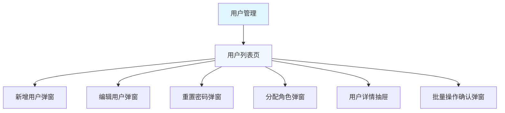
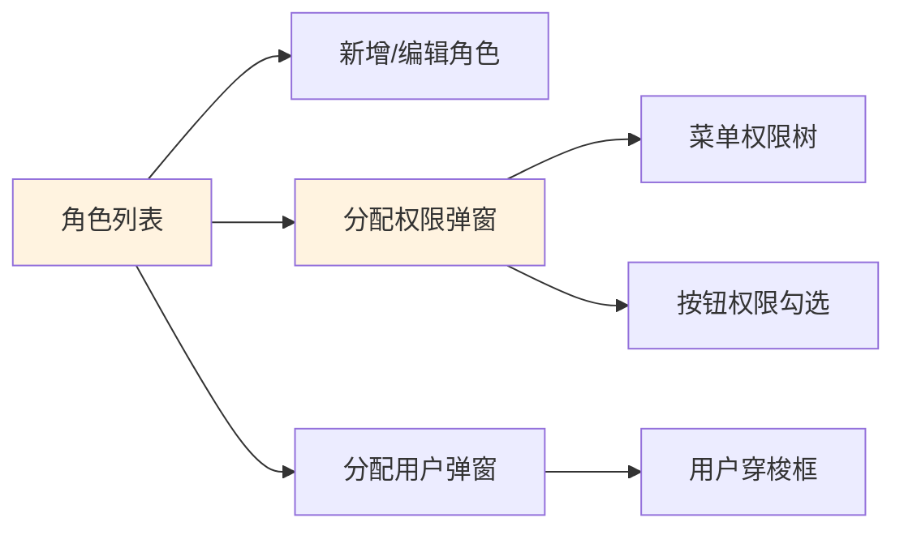
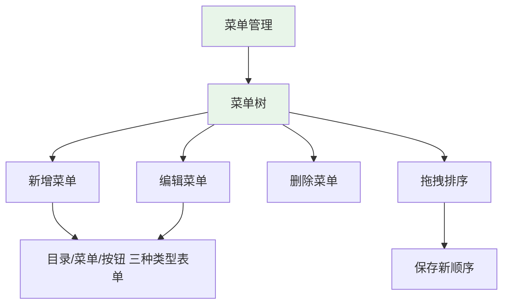
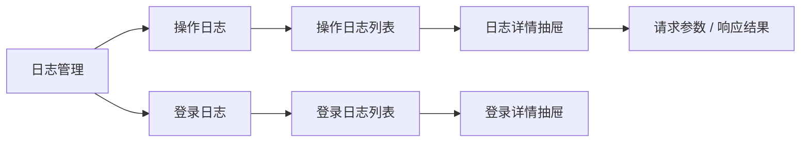
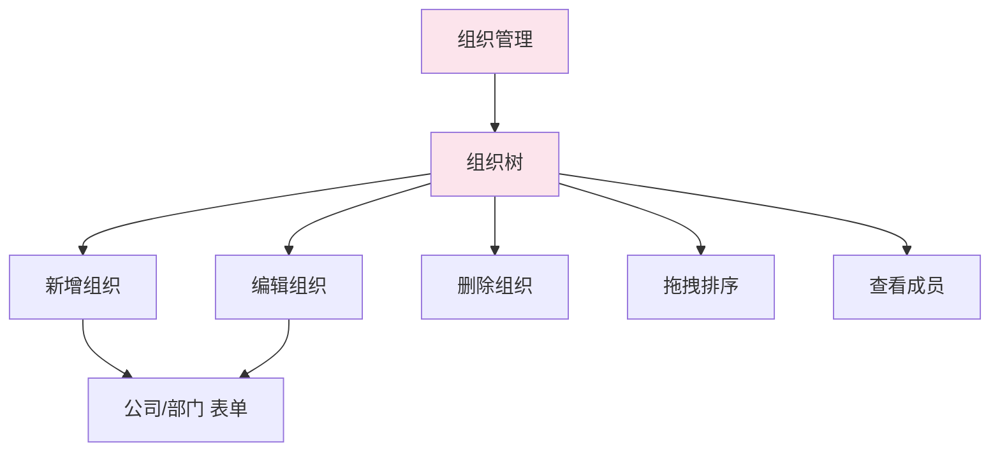
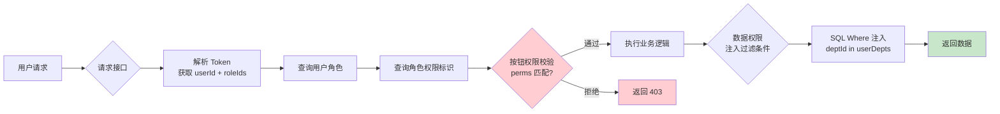
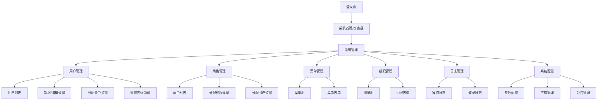
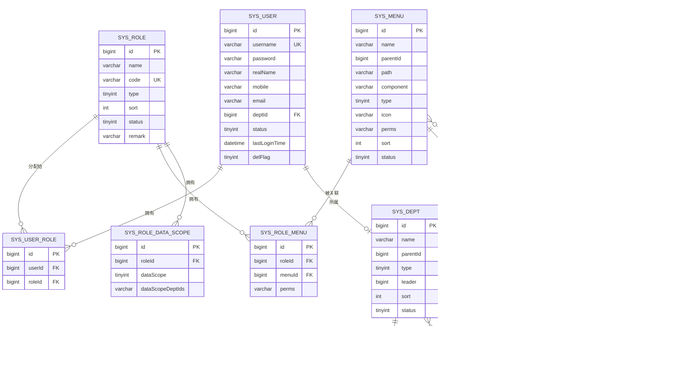

# 通用权限管理后台系统（RBAC）产品需求文档

| 项目 | 内容 |
|------|------|
| 文档版本 | v1.0 |
| 更新日期 | 2026-03-31 |
| 状态 | 初稿 |

---

## 一、项目概述

### 1.1 项目背景

企业级系统普遍存在多角色、多权限的管理需求。传统硬编码权限方式维护成本高、扩展性差。本系统旨在构建一套通用的、组件化的权限管理后台，支持 Web 管理端（React+AntD）和移动端（Taro小程序），满足各类业务系统的权限管理需求。

### 1.2 系统目标

- 提供完整的 RBAC 模型（用户-角色-权限）实现
- 支持菜单、按钮、数据三个维度的权限控制
- 管理后台与移动端一套接口，复用性强
- 高扩展性，支持多租户基础架构

### 1.3 技术栈

| 端 | 技术栈 |
|----|--------|
| 后端 | NestJS + TypeORM + MySQL + Redis |
| Web 前端 | React 18 + Ant Design 5 + UmiJS |
| 移动端 | Taro 3 + React Native |
| 认证 | JWT + RefreshToken |
| 文档 | Swagger / OpenAPI 3.0 |

### 1.4 术语定义

| 术语 | 定义 |
|------|------|
| RBAC | Role-Based Access Control，基于角色的访问控制 |
| 菜单权限 | 用户可访问的页面/菜单项 |
| 按钮权限 | 页面内操作按钮的显示/隐藏控制 |
| 数据权限 | 用户可查看/操作的数据范围（如本部门数据） |
| 租户 | 多租户场景下的隔离单位，可对应公司/组织 |

---

## 二、优先级总览

| 优先级 | 模块 |
|--------|------|
| **P0** | 用户管理、角色管理、登录认证 |
| **P1** | 菜单管理、权限分配（日志管理） |
| **P2** | 数据权限、组织管理、系统配置 |

> **P0** = 系统运行核心，必须首期交付  
> **P1** = 重要功能，P0 完成后立即开发  
> **P2** = 锦上添花，可分期迭代

---

## 三、模块详细设计

---

### 模块 1：用户管理（P0）

#### 3.1.1 功能描述

用户管理是系统的基础模块，负责系统内所有用户账号的全生命周期管理。

**核心功能点：**

| 功能 | 描述 |
|------|------|
| 用户列表 | 支持分页、关键词（姓名/手机/账号）搜索，状态筛选 |
| 新增用户 | 填写基本信息、选择所属组织、绑定角色 |
| 编辑用户 | 修改用户基本信息、角色、组织 |
| 删除用户 | 软删除，保留数据可追溯 |
| 状态管理 | 启用/禁用账号，禁用后不可登录 |
| 密码重置 | 管理员可重置密码，支持生成随机密码或自定义 |
| 批量操作 | 批量启用/禁用/删除 |
| 查看用户详情 | 查看基本信息、拥有的角色、操作日志 |
| 导出用户 | 导出用户列表 Excel |

**字段设计：**

| 字段 | 类型 | 说明 |
|------|------|------|
| id | bigint | 主键 |
| username | varchar(50) | 登录账号，唯一 |
| password | varchar(255) | 加密存储（bcrypt） |
| realName | varchar(50) | 真实姓名 |
| mobile | varchar(20) | 手机号 |
| email | varchar(100) | 邮箱 |
| avatar | varchar(255) | 头像 URL |
| status | tinyint | 1=正常 0=禁用 |
| deptId | bigint | 所属部门 ID |
| lastLoginTime | datetime | 最后登录时间 |
| lastLoginIp | varchar(50) | 最后登录 IP |
| createTime | datetime | 创建时间 |
| updateTime | datetime | 更新时间 |
| createBy | bigint | 创建人 |
| delFlag | tinyint | 删除标志 0=未删 1=已删 |

**业务规则：**
- 用户名唯一，不允许重复
- 手机号格式校验
- 密码重置后需强制修改或通知用户
- 管理员不可删除自己
- 禁用用户自动解除所有角色绑定

#### 3.1.2 页面结构（Mermaid）



**页面说明：**

```
用户管理
├── 用户列表页（主页面）
│   ├── 顶部操作栏：新增用户 / 批量禁用 / 批量删除 / 导出
│   ├── 筛选区域：关键词搜索 / 状态筛选 / 部门筛选
│   ├── 数据表格
│   │   ├── 列：复选框 / 用户名 / 姓名 / 手机 / 部门 / 角色 / 状态 / 创建时间 / 操作
│   │   └── 操作：编辑 / 重置密码 / 禁用启用 / 删除
│   └── 底部：分页组件
├── 新增用户弹窗
├── 编辑用户弹窗
├── 重置密码弹窗
├── 分配角色弹窗（树形选择角色）
└── 用户详情抽屉
    ├── 基本信息 Tab
    ├── 角色信息 Tab
    └── 操作日志 Tab
```

#### 3.1.3 API 接口清单

| # | 接口 | 方法 | 路径 | 描述 |
|---|------|------|------|------|
| 1 | 获取用户列表 | GET | /api/users | 分页查询用户 |
| 2 | 获取用户详情 | GET | /api/users/:id | 获取单个用户信息 |
| 3 | 新增用户 | POST | /api/users | 创建用户 |
| 4 | 编辑用户 | PUT | /api/users/:id | 编辑用户 |
| 5 | 删除用户 | DELETE | /api/users/:id | 删除用户（软删） |
| 6 | 批量删除用户 | DELETE | /api/users/batch | 批量删除 |
| 7 | 重置密码 | POST | /api/users/:id/reset-password | 重置密码 |
| 8 | 修改用户状态 | PATCH | /api/users/:id/status | 启用/禁用 |
| 9 | 分配用户角色 | PUT | /api/users/:id/roles | 绑定角色 |
| 10 | 获取用户角色 | GET | /api/users/:id/roles | 获取用户已有角色 |
| 11 | 导出用户列表 | GET | /api/users/export | 导出 Excel |

**接口详情：**

```
GET /api/users
Query: { page, pageSize, keyword?, status?, deptId? }
Response: { list: User[], total, page, pageSize }

POST /api/users
Body: { username, realName, mobile?, email?, deptId?, roleIds[] }
Response: { id, username, ... }

PUT /api/users/:id
Body: { realName?, mobile?, email?, deptId?, roleIds[]? }
Response: { id, ... }

DELETE /api/users/:id
Response: { success: true }

POST /api/users/:id/reset-password
Body: { password? } // 不传则生成随机密码
Response: { password: "xxxx" } // 仅返回明文密码一次

PATCH /api/users/:id/status
Body: { status: 0 | 1 }
Response: { success: true }

PUT /api/users/:id/roles
Body: { roleIds: number[] }
Response: { success: true }
```

---

### 模块 2：角色管理（P0）

#### 3.2.1 功能描述

角色管理是 RBAC 模型的核心，承上启下：向上关联权限（菜单/按钮/数据权限），向下分配给用户。

**核心功能点：**

| 功能 | 描述 |
|------|------|
| 角色列表 | 分页展示所有角色，显示角色类型、人数 |
| 新增角色 | 创建角色，设置角色类型 |
| 编辑角色 | 修改角色基本信息 |
| 删除角色 | 删除前检查是否已有用户使用 |
| 角色类型 | 系统角色（不可删）/ 自定义角色 |
| 分配权限 | 以菜单树形式勾选权限 |
| 分配用户 | 为角色批量绑定/解绑用户 |
| 查看角色详情 | 查看角色权限配置、关联用户列表 |

**字段设计：**

| 字段 | 类型 | 说明 |
|------|------|------|
| id | bigint | 主键 |
| name | varchar(50) | 角色名称 |
| code | varchar(50) | 角色编码，唯一，如 ADMIN |
| type | tinyint | 1=系统角色 2=自定义角色 |
| sort | int | 排序号 |
| status | tinyint | 1=正常 0=禁用 |
| remark | varchar(255) | 备注说明 |
| createTime | datetime | 创建时间 |
| updateTime | datetime | 更新时间 |

**业务规则：**
- 角色编码全局唯一
- 系统预置角色（超管、运营等）不可删除
- 删除角色前检查是否绑定用户，如有则提示先解绑
- 一个用户可拥有多个角色，权限取并集

#### 3.2.2 页面结构

```
角色管理
├── 角色列表页
│   ├── 顶部操作栏：新增角色
│   ├── 数据表格
│   │   ├── 列：角色名称 / 角色编码 / 类型 / 人数 / 状态 / 创建时间 / 操作
│   │   └── 操作：编辑 / 删除 / 分配权限 / 分配用户
│   └── 分页组件
├── 新增/编辑角色弹窗
├── 分配权限弹窗（左侧菜单树 + 右侧按钮勾选）
└── 分配用户弹窗（用户列表穿梭框）
```



#### 3.2.3 API 接口清单

| # | 接口 | 方法 | 路径 | 描述 |
|---|------|------|------|------|
| 1 | 获取角色列表 | GET | /api/roles | 分页查询角色 |
| 2 | 获取角色详情 | GET | /api/roles/:id | 获取单个角色 |
| 3 | 新增角色 | POST | /api/roles | 创建角色 |
| 4 | 编辑角色 | PUT | /api/roles/:id | 编辑角色 |
| 5 | 删除角色 | DELETE | /api/roles/:id | 删除角色 |
| 6 | 获取角色权限 | GET | /api/roles/:id/permissions | 获取角色已分配的权限 |
| 7 | 分配角色权限 | PUT | /api/roles/:id/permissions | 保存角色权限配置 |
| 8 | 获取角色用户列表 | GET | /api/roles/:id/users | 获取角色下所有用户 |
| 9 | 分配角色用户 | PUT | /api/roles/:id/users | 为角色分配用户 |

---

### 模块 3：菜单管理（P1）

#### 3.3.1 功能描述

菜单管理负责维护系统的导航菜单结构，同时管理每个菜单项关联的前端路由和权限标识，是动态菜单和按钮权限的基础。

**核心功能点：**

| 功能 | 描述 |
|------|------|
| 菜单列表 | 树形结构展示所有菜单，支持拖拽排序 |
| 新增菜单 | 支持新增目录/菜单/按钮三种类型 |
| 编辑菜单 | 修改菜单信息 |
| 删除菜单 | 删除前检查子菜单和按钮 |
| 拖拽排序 | 拖拽调整菜单顺序和父子关系 |
| 图标管理 | 菜单图标选择（AntD Icons） |
| 前端路由 | 关联前端路由路径和参数 |
| 权限标识 | 菜单对应的权限字符（用于按钮级别控制） |
| 外部链接 | 支持第三方 URL 跳转 |
| 缓存配置 | 路由缓存开启/关闭 |

**菜单类型说明：**

| 类型 | 说明 | 示例 |
|------|------|------|
| 目录 | 一级分类，不可关联页面 | 系统管理 |
| 菜单 | 可访问的页面 | /system/user |
| 按钮 | 页面内操作（如"新增"、"删除"） | user:add |

**字段设计：**

| 字段 | 类型 | 说明 |
|------|------|------|
| id | bigint | 主键 |
| name | varchar(50) | 菜单名称 |
| parentId | bigint | 父菜单 ID，0=顶级 |
| path | varchar(200) | 路由路径 |
| component | varchar(200) | 前端组件路径 |
| type | tinyint | 1=目录 2=菜单 3=按钮 |
| icon | varchar(50) | 图标名称 |
| sort | int | 排序号 |
| perms | varchar(100) | 权限标识，如 system:user:list |
| isFrame | tinyint | 是否外链 0=否 1=是 |
| isCache | tinyint | 是否缓存 0=否 1=是 |
| isVisible | tinyint | 是否显示 0=隐藏 1=显示 |
| status | tinyint | 状态 1=正常 0=禁用 |
| createTime | datetime | 创建时间 |

#### 3.3.2 页面结构

```
菜单管理
├── 菜单列表页（左侧树形 / 右侧详情）
│   ├── 左侧：菜单树（支持拖拽）
│   └── 右侧：选中菜单详情 / 新增表单
├── 新增/编辑菜单弹窗
└── 按钮权限配置（随菜单展开）
```



#### 3.3.3 API 接口清单

| # | 接口 | 方法 | 路径 | 描述 |
|---|------|------|------|------|
| 1 | 获取菜单树 | GET | /api/menus/tree | 获取完整菜单树 |
| 2 | 获取菜单列表（平铺） | GET | /api/menus | 分页查询 |
| 3 | 获取菜单详情 | GET | /api/menus/:id | 获取单个菜单 |
| 4 | 新增菜单 | POST | /api/menus | 创建菜单 |
| 5 | 编辑菜单 | PUT | /api/menus/:id | 编辑菜单 |
| 6 | 删除菜单 | DELETE | /api/menus/:id | 删除菜单 |
| 7 | 拖拽排序 | PUT | /api/menus/sort | 批量保存排序 |
| 8 | 获取用户动态菜单 | GET | /api/menus/user | 获取当前用户的菜单（根据角色权限） |

---

### 模块 4：权限管理（P1）

#### 3.4.1 功能描述

权限管理涵盖按钮级别权限和数据级别权限，是 RBAC 的精细化控制核心。

**4.4.1 按钮权限**

按钮权限基于菜单的权限标识实现，控制页面内"新增"、"编辑"、"删除"等按钮的显示隐藏。

| 功能 | 描述 |
|------|------|
| 权限标识定义 | 在菜单管理中为每个按钮定义唯一权限字符 |
| 角色按钮权限 | 在角色管理中为角色勾选可用的按钮权限 |
| 前端权限指令 | 提供 React 组件级权限封装（Permission 组件） |
| 接口权限校验 | 后端接口层校验当前用户是否有对应权限字符 |

**按钮权限标识示例：**

| 菜单 | 按钮 | 权限标识 |
|------|------|----------|
| 用户管理 | 查看 | system:user:list |
| 用户管理 | 新增 | system:user:add |
| 用户管理 | 编辑 | system:user:edit |
| 用户管理 | 删除 | system:user:delete |
| 用户管理 | 重置密码 | system:user:resetPwd |

**4.4.2 数据权限**

数据权限控制用户可访问的数据范围，支持多层级配置。

| 级别 | 说明 |
|------|------|
|全部 | 可查看所有数据 |
| 本部门及以下 | 仅可见自己及下属部门数据 |
| 本部门 | 仅可见本部门数据 |
| 仅本人 | 仅可见自己的数据 |
| 自定义 | 按指定部门/用户范围 |

**数据权限配置：**

- 在角色管理中为角色配置数据权限级别
- 自定义级别需配置可见的部门/用户白名单
- 后端 SQL 拦截器自动注入数据权限过滤条件

#### 3.4.2 API 接口清单

| # | 接口 | 方法 | 路径 | 描述 |
|---|------|------|------|------|
| 1 | 获取角色按钮权限 | GET | /api/roles/:id/button-permissions | 获取角色可用的按钮权限标识列表 |
| 2 | 分配角色按钮权限 | PUT | /api/roles/:id/button-permissions | 保存按钮权限 |
| 3 | 获取角色数据权限 | GET | /api/roles/:id/data-scope | 获取角色数据权限配置 |
| 4 | 分配角色数据权限 | PUT | /api/roles/:id/data-scope | 保存数据权限（级别+自定义范围） |
| 5 | 校验接口权限 | POST | /api/permissions/check | 前端调用校验当前用户是否有某按钮权限 |

---

### 模块 5：日志管理（P1）

#### 3.5.1 功能描述

日志管理记录用户在系统中的操作行为和登录情况，支持安全审计和问题追溯。

**5.5.1 操作日志**

记录用户在系统中的每一次 CRUD 操作。

| 字段 | 类型 | 说明 |
|------|------|------|
| id | bigint | 主键 |
| userId | bigint | 操作人 ID |
| username | varchar(50) | 操作人账号 |
| operation | varchar(50) | 操作类型（新增/编辑/删除/查询等） |
| module | varchar(50) | 操作模块（用户管理/角色管理等） |
| method | varchar(100) | 请求方法 |
| url | varchar(255) | 请求地址 |
| ip | varchar(50) | IP 地址 |
| location | varchar(100) | IP 归属地 |
| params | text | 请求参数 |
| result | tinyint | 结果 1=成功 0=失败 |
| errorMsg | text | 错误信息（失败时） |
| duration | int | 请求耗时 ms |
| createTime | datetime | 操作时间 |

**5.5.2 登录日志**

记录用户登录/登出行为。

| 字段 | 类型 | 说明 |
|------|------|------|
| id | bigint | 主键 |
| userId | bigint | 用户 ID |
| username | varchar(50) | 用户账号 |
| loginType | varchar(20) | 登录方式（账号密码/手机验证码/扫码等） |
| ip | varchar(50) | 登录 IP |
| location | varchar(100) | IP 归属地 |
| device | varchar(100) | 设备信息 |
| os | varchar(50) | 操作系统 |
| browser | varchar(50) | 浏览器 |
| status | tinyint | 1=成功 0=失败 |
| msg | varchar(100) | 消息 |
| createTime | datetime | 登录时间 |

**核心功能点：**

| 功能 | 描述 |
|------|------|
| 操作日志列表 | 分页查看操作日志，支持按模块/操作人/时间筛选 |
| 登录日志列表 | 分页查看登录日志，支持按账号/状态/时间筛选 |
| 日志详情 | 查看单条日志的完整信息（请求参数、响应结果） |
| 日志导出 | 导出指定时间范围的日志 |
| 日志清理 | 定期自动清理历史日志（可配置保留天数） |

#### 3.5.2 页面结构

```
日志管理
├── 操作日志
│   ├── 操作日志列表页
│   │   ├── 筛选：时间范围 / 模块 / 操作人 / 操作类型 / 结果
│   │   └── 表格：操作人 / 模块 / 操作 / IP / 耗时 / 时间 / 操作
│   └── 日志详情抽屉
└── 登录日志
    ├── 登录日志列表页
    │   ├── 筛选：时间范围 / 账号 / 登录状态
    │   └── 表格：账号 / 登录方式 / IP / 设备 / 状态 / 时间 / 操作
    └── 登录详情抽屉
```



#### 3.5.3 API 接口清单

| # | 接口 | 方法 | 路径 | 描述 |
|---|------|------|------|------|
| 1 | 获取操作日志列表 | GET | /api/logs/operation | 分页查询操作日志 |
| 2 | 获取操作日志详情 | GET | /api/logs/operation/:id | 获取单条操作日志 |
| 3 | 获取登录日志列表 | GET | /api/logs/login | 分页查询登录日志 |
| 4 | 获取登录日志详情 | GET | /api/logs/login/:id | 获取单条登录日志 |
| 5 | 导出操作日志 | GET | /api/logs/operation/export | 导出操作日志 Excel |
| 6 | 导出登录日志 | GET | /api/logs/login/export | 导出登录日志 Excel |
| 7 | 清理历史日志 | DELETE | /api/logs/cleanup | 清理N天前的日志 |

---

### 模块 6：组织管理（P2）

#### 3.6.1 功能描述

组织管理维护公司/部门树形结构，为用户提供归属组织，并支持数据权限的部门级别控制。

**核心功能点：**

| 功能 | 描述 |
|------|------|
| 组织树 | 树形结构展示所有部门/公司，支持展开折叠 |
| 新增组织 | 新增公司或部门，设置上级组织 |
| 编辑组织 | 修改组织信息 |
| 删除组织 | 删除前检查是否有子组织或在职员工 |
| 拖拽排序 | 拖拽调整组织顺序 |
| 组织详情 | 查看组织基本信息、成员数量、下级组织 |
| 成员查看 | 查看某部门下的所有用户 |
| 禁用/启用 | 禁用部门后该部门用户一并无法登录 |

**字段设计：**

| 字段 | 类型 | 说明 |
|------|------|------|
| id | bigint | 主键 |
| name | varchar(50) | 组织名称 |
| parentId | bigint | 父组织 ID，0=顶级公司 |
| type | tinyint | 1=公司 2=部门 |
| leader | bigint | 负责人用户 ID |
| phone | varchar(20) | 联系电话 |
| email | varchar(100) | 邮箱 |
| sort | int | 排序号 |
| status | tinyint | 1=正常 0=禁用 |
| createTime | datetime | 创建时间 |

#### 3.6.2 页面结构

```
组织管理
├── 组织树页面
│   ├── 左侧：组织树（支持拖拽）
│   └── 右侧：选中组织详情 / 新增表单
├── 新增/编辑组织弹窗
└── 成员列表抽屉
```



#### 3.6.3 API 接口清单

| # | 接口 | 方法 | 路径 | 描述 |
|---|------|------|------|------|
| 1 | 获取组织树 | GET | /api/depts/tree | 获取完整组织树 |
| 2 | 获取组织列表 | GET | /api/depts | 分页查询组织 |
| 3 | 获取组织详情 | GET | /api/depts/:id | 获取单个组织 |
| 4 | 新增组织 | POST | /api/depts | 创建组织 |
| 5 | 编辑组织 | PUT | /api/depts/:id | 编辑组织 |
| 6 | 删除组织 | DELETE | /api/depts/:id | 删除组织 |
| 7 | 拖拽排序 | PUT | /api/depts/sort | 批量保存排序 |
| 8 | 获取组织成员 | GET | /api/depts/:id/users | 获取组织下所有用户 |

---

### 模块 7：系统配置（P2）

#### 3.7.1 功能描述

系统配置提供各类参数的可视化管理，减少硬编码，提升系统的可维护性和可配置性。

**核心功能点：**

| 功能 | 描述 |
|------|------|
| 参数配置 | 基础参数键值对管理，支持分组 |
| 敏感配置 | 存储加密的密钥、第三方凭证等 |
| 字典管理 | 枚举类型数据字典，支持增删改 |
| 公告管理 | 系统公告发布（支持站内通知） |
| 配置同步 | 修改配置后无需重启，自动生效 |
| 配置分组 | 按模块分组展示（登录配置/安全配置/通知配置等） |

**参数配置示例：**

| 分组 | 键 | 值 | 说明 |
|------|-----|-----|------|
| 登录配置 | password.minLength | 8 | 密码最小长度 |
| 登录配置 | password.expireDays | 90 | 密码过期天数 |
| 安全配置 | login.maxRetry | 5 | 登录最大重试次数 |
| 安全配置 | login.lockMinutes | 30 | 账号锁定分钟数 |
| 系统配置 | system.name | 通用权限系统 | 系统名称 |

**字典管理示例：**

| 字典类型 | 字典项 |
|---------|--------|
| user_status | { label: 正常, value: 1 }, { label: 禁用, value: 0 } |
| menu_type | { label: 目录, value: 1 }, { label: 菜单, value: 2 }, { label: 按钮, value: 3 } |
| data_scope | { label: 全部, value: 1 }, { label: 本部门及以下, value: 2 }, { label: 本部门, value: 3 }, { label: 仅本人, value: 4 }, { label: 自定义, value: 5 } |

#### 3.7.2 页面结构

```
系统配置
├── 参数配置
│   ├── 参数列表（按分组展示 Tab）
│   ├── 编辑参数弹窗
│   └── 新增参数弹窗
├── 字典管理
│   ├── 字典类型列表
│   ├── 字典项列表（选中类型后展示）
│   ├── 新增/编辑字典类型弹窗
│   └── 新增/编辑字典项弹窗
└── 公告管理
    ├── 公告列表
    ├── 新增/编辑公告弹窗
    └── 公告详情弹窗
```

#### 3.7.3 API 接口清单

| # | 接口 | 方法 | 路径 | 描述 |
|---|------|------|------|------|
| 1 | 获取参数列表 | GET | /api/configs | 分组获取配置 |
| 2 | 获取单个参数 | GET | /api/configs/:key | 获取配置值 |
| 3 | 更新参数 | PUT | /api/configs/:key | 更新配置 |
| 4 | 获取字典类型列表 | GET | /api/dicts/types | 获取所有字典类型 |
| 5 | 获取字典项列表 | GET | /api/dicts/:type/items | 获取某类型的字典项 |
| 6 | 新增字典类型 | POST | /api/dicts/types | 创建字典类型 |
| 7 | 编辑字典类型 | PUT | /api/dicts/types/:id | 编辑字典类型 |
| 8 | 新增字典项 | POST | /api/dicts/items | 创建字典项 |
| 9 | 编辑字典项 | PUT | /api/dicts/items/:id | 编辑字典项 |
| 10 | 删除字典项 | DELETE | /api/dicts/items/:id | 删除字典项 |
| 11 | 获取公告列表 | GET | /api/notices | 分页查询公告 |
| 12 | 新增公告 | POST | /api/notices | 发布公告 |
| 13 | 编辑公告 | PUT | /api/notices/:id | 编辑公告 |
| 14 | 删除公告 | DELETE | /api/notices/:id | 删除公告 |

---

## 四、认证与授权（P0）

### 4.1 登录认证

| 接口 | 方法 | 路径 | 描述 |
|------|------|------|------|
| 用户登录 | POST | /api/auth/login | 账号密码登录 |
| 退出登录 | POST | /api/auth/logout | 退出登录 |
| 获取刷新 Token | POST | /api/auth/refresh | 刷新 AccessToken |
| 获取用户信息 | GET | /api/auth/userinfo | 获取当前登录用户信息 |

### 4.2 Token 设计

- AccessToken：有效期 2 小时，存储在内存中
- RefreshToken：有效期 7 天，存储在 HTTPOnly Cookie
- 登录时返回用户基本信息 + 权限标识列表 + 动态菜单树

---

## 五、数据权限流程



---

## 六、页面结构总览（Mermaid）



---

## 七、数据库设计概要（ER 图）



---

## 八、分期实施计划

| 阶段 | 内容 | 模块 | 优先级 |
|------|------|------|--------|
| **第一期** | 核心框架：数据库设计、Auth 认证、角色管理、用户管理、基础菜单管理 | P0 | 4 周 |
| **第二期** | 完善权限：按钮权限、数据权限、操作日志、登录日志 | P1 | 2 周 |
| **第三期** | 运营配套：组织管理、系统配置（字典+参数+公告） | P2 | 2 周 |
| **第四期** | 移动端：Taro 小程序接入（与 Web 共用后端 API） | - | 2 周 |

---

## 九、风险与依赖

| 风险项 | 影响 | 应对措施 |
|--------|------|----------|
| 数据权限 SQL 注入复杂度 | 数据泄露风险 | 使用 ORM 预编译，禁止拼接 SQL |
| 动态路由缓存 | 权限变更后需清理缓存 | Redis 监听变更事件主动推送 |
| 多租户扩展 | 后续需支持多租户隔离 | 字段预留 tenantId，架构设计上兼容 |
| 性能：大数据量日志 | 日志表数据膨胀 | 分表分库 + 定期归档清理 |

---

*文档结束*
